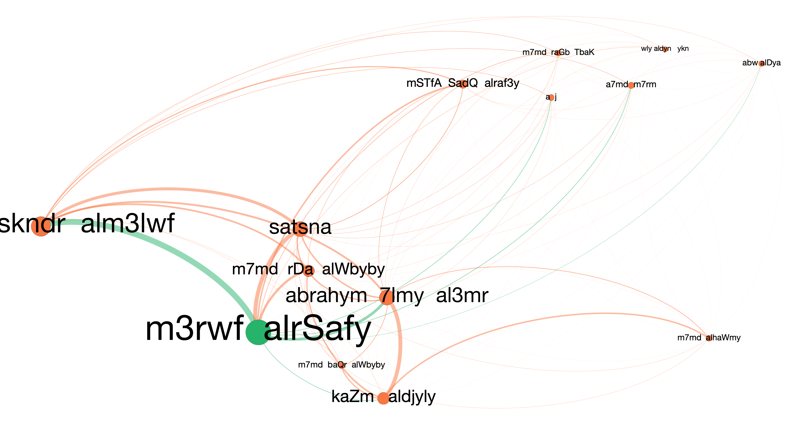
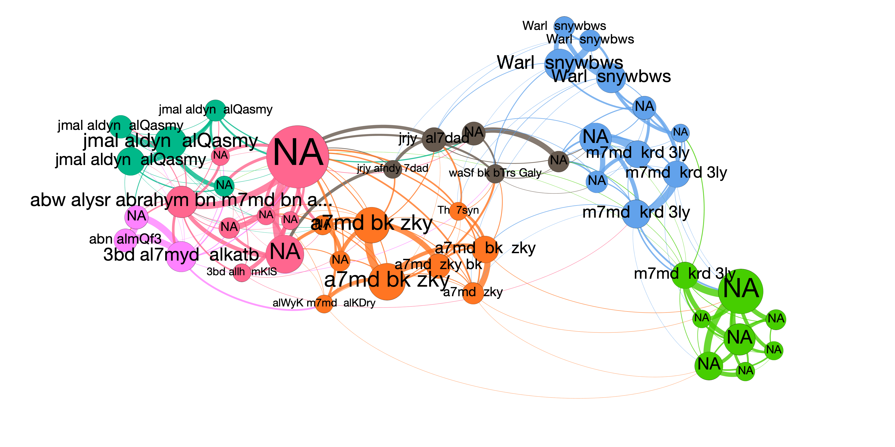
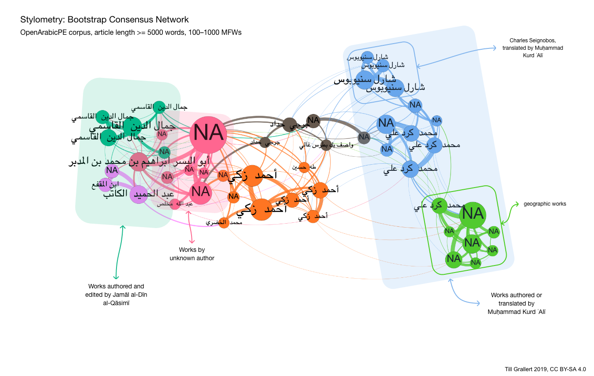

<!-- # processing instructions -->
<!-- pre-process with pancritic -->
<!-- pancritic catch-me-if-you-can.md -t markdown --critic-mode accept -o catch-me-if-you-can_changes-accepted.md -->

# About #

> This paper originated in a presentation at Turkologentag 2018 in Bamberg, Germany, 19--21 September 2018. The computational analysis was first presented at the international workshop "Creating Spaces, Connecting Worlds: Dimensions of the Press in the Middle East and Eurasia" in Zurich, 31 October -- 2 November 2019. The final version is meant for submission to a special issue of "Geschichte und Gesellschaft".
> 
> The current stable draft of this paper is version [v0.3](https://tillgrallert.github.io/p3a6afa20/v0-3/index.html) and contains unprocessed references to sources and secondary literature, cross-references, and CriticMarkup. To comment / review / annotate this version via hypothes.is click [here](https://via.hypothes.is/https://tillgrallert.github.io/p3a6afa20/v0-3/index.html). The most recent changes are available [here](https://tillgrallert.github.io/p3a6afa20/index.html).
> 
> Note that network plots make use of a computational transcription of Arabic into Latin script because the intended general audience is assumed to not be able to read Arabic.
> 
> High-resolution plots, data sets and other supplementary data can can be found at <https://github.com/tillgrallert/s3a6afa20>. If this paper gets accepted for publication, releases of this repository will be uploaded to Zenodo and get a DOI.

# Introduction #

This paper presents the dual challenge of {=="digital history"==} to the study of the {==ideosphere==}{>>Explain<<} of the late Ottoman Eastern {==Mediterranean==}{>>One could reference [@Scheffler+2003] on the mental maps of Southwest Asia<<} through its periodical press.[^cf1] The first challenge is to confront hyperbolic promises of mass digitisation and computational methods for the exploration of digitised cultural heritage as a hegemonic episteme rooted in 20th-century, english-speaking, neoliberal capitalism from the margins---That is, the study of a historical multilingual society whose material heritage has been looted, destroyed and neglected. A society, whose material heritage resists digitisation efforts by being dependent on non-Latin scripts and, for instance, non-Gregorian calendars. A society, whose contemporary heirs cannot draw on the vast resources in wealth and socio-technical infrastructures of the Global North. The second challenge is to actually explore the ideosphere of periodicals and their contributors{>> through computational approaches such as network analysis and stylometry<<}.

Early Arabic periodicals{-- from the late nineteenth and early twentieth centuries--}, such as <persName>Butrus al-Bustānī</persName>'s *al-Jinān* (Beirut, 1876--86), <persName>Yaʿqūb Ṣarrūf</persName>, <persName>Fāris Nimr</persName>, and <persName>Shāhīn Makāriyūs</persName>' *al-Muqtaṭaf* (Beirut and Cairo, 1876--1952), <persName>Muḥammad Kurd ʿAlī</persName>'s *al-Muqtabas* (Cairo and Damascus, 1906--18/19) or <persName>Rashīd Riḍā</persName>'s *al-Manār* (Cairo, 1898--1941) are at the core of formative discourses that still reverberate through the Arabic-speaking Middle East: the Arabic (cultural) renaissance (*nahḍa*), Arab nationalism, and the Islamic reform movement (*ṣalafiyya*). The Arabic periodical press of the late Ottoman Eastern Mediterranean has received scholarly attention since the early twentieth century. Yet, core questions concerning the intellectual history of the periodical press and the social history of periodical production are still unanswered. Arabic approaches to the periodical press have been, for a long time, both encyclopaedic and anecdotal as well as biased by an almost exclusive focus on Cairo and Beirut. Many of these works were compiled by authors who themselves were journalist and adhere to a specific political view of Arab nationalism and demonize the Ottoman Empire, particularly during the reign of <persName>ʿAbdülḥamīd II</persName> (1876--1909).[^fn1] Non-Arabic scholarship commonly perceives of journals and newspapers as a source for intellectual, social and political history but only rarely as a subject in its own right. There is the noteworthy exception of Ami Ayalon's extensive writings on the press in the Arab Middle East,[^fn2] but comprehensive, synthesising approaches are severely limited by the almost complete absence of systematic studies on individual periodicals.[^cf2]{>>Add comment on [@Dierauff+2018][@Beška+2017]<<} Even scholarly approaches to the press as a source remain largely anecdotal with a focus on opinion pieces and editorials in a small sample of canonical journals from Beirut and Cairo. The main reasons are scale and scattered collections, which, however, remain {--completely--}{>>{--largely--}<<}{-- --}unacknowledged.

{>>Bibliographies: [@AhmedBioud+1969]<<}

{>>the following section needs rewriting
<<}
In consequence, we still need to answer questions such as: What are the core nodes (authors, periodicals, other works) in the ideosphere of the late Ottoman Eastern Mediterranean? Is the geographic bias of Cairo and Beirut justified if we look at more than the "easily" accessible handful of monthly journals mentioned above? How would we need to re-write the intellectual history of the final decades of the Ottoman Empire if the myriad of papers and their contributors from places as far as Algiers, Basra or Aleppo were included? The answers to these questions depend on another set of questions: Who authored the majority of articles in any one periodical that did not carry a byline? Can we confirm the common---and untested---assumption that the proprietor or editor-in-chief mentioned in a journal's imprint or a newspaper's masthead just authored all the anonymous texts themselves? {>>Even if they were absent from the place of publication for prolonged periods of time, as we know they repeatedly were?<<} Is it true, as some suspect, that editors invented contributors to their journals from far-away places to impress their audiences?

{>>the following can remain: summary<<}

This paper explores the late Ottoman ideosphere of the Eastern Mediterranean through the question of authorship and references to other periodical titles and the resulting intellectual, social and geographic networks. It presents a first foray into computational approaches to these questions by adopting methods broadly summarised as *distant reading*, namely social network analysis and stylometry. {--Computational methods depend on digital corpora. --}I start by contrasting the hyperbolic promises of digitisation with the bleak reality of extremely limited access to unsystematically digitised facsimile corpora of Arabic periodicals from the late Ottoman Eastern Mediterranean. A socio-technical infrastructure built upon English and Latin script as the hegemonic technical paradigm, I argue, contributes to a neo-colonial divide between the abundance of digitised cultural artefacts of the Global North and the invisibility of almost anything beyond. This necessitates substantial corpus building efforts for many scholars working on texts in non-Western languages written in non-Latin scripts and severely limits the scope of our computational scrutiny.

I introduce my corpus-building project ["Open Arabic Periodical Editions" (OpenArabicPE)](https://openarabicpe.github.io/) as a framework to unite transcriptions of a small number of early twentieth-century periodicals from grey online platforms with digital facsimiles for the purpose of validating the former. Consequently, any corpus built {==with these affordances==}{>>better wording<<} and the dependence on the work of anonymous others will not be systematically tailored to the research questions one might have. After substantial modelling efforts, I am now able to generate and analyse bibliographic datasets as well as run first stylometric analyses on this corpus of some 165 periodical issues of c. 2.65 million words. Although the approach can by no means be characterised as distant reading of big data, it is the first systematic attempt to empirically answer core questions for the nascent field of Arabic periodical studies, which are in turn indispensable for a proper source critique if one wanted to employ these periodicals for the historiography of the late Ottoman Eastern Mediterranean.

{>>add paragraph summarising my results: The geographic realm must be broadened to at least include Iraq but also Sudan (as in the case of al-Zuhūr, which doesn't feature in this paper)<<}

# The promised land of digitised Arabic periodicals #

The better known and at the time widely popular Arabic journals of the late Ottoman Empire{-----unlike their smaller rivals and more ephemeral newspaper copies-----}{++ ++}do not face the ultimate danger of their last copy being destroyed in the current onslaught from iconoclasts, institutional neglect, and wars raging through Syria, Libya, Yemen, and Iraq. Yet, copies are scattered across library and private collections worldwide. Many collections remain unknown to scholarly communities. If catalogues exist, they are not necessarily available online and union catalogues have fallen out of fashion.[^fn3] This makes it almost impossible to trace discourses across journals and with the demolition and closure of libraries in the Middle East, they are increasingly accessible to the affluent Western researcher only.

A quick look at al-Muqtabas shall illustrate this point ([@fig:holdings-muqtabas]). A search in [WorldCat](https://www.worldcat.org/) for the nine volumes of al-Muqtabas will return six different bibliographic entries, the first of which has 13 variants (called "editions" in the context of WorldCat), pointing to 34 libraries. If one follows each entry to the holding library's catalogue, one will find that the large majority of collections is incomplete and that collections commonly combine original volumes, reprints, microfilms, microfiches and even photo {==copies==}{>>comment on the geographic distribution of collections: the map below shows a surprising distribution of copies, which could either be due to Worldcat's bias towards western collections or a reflection of actual holdings. But even for regions with good coverage, such as central Europe, we can attest that interested readers would need to travel or depend on interlibrary loans to excess every issue of al-Muqtabas.<<}.

{#fig:holdings-muqtabas}

Digitisation promises an "easy" solution to the problems of preservation and access. Instant access to tens if not hundreds of thousands of *digitised* periodical issues from the late Ottoman Empire evokes the gold rush in the American west and many people imagine a promised land of instantaneous one-click answers to any question they might have. The public and many scholars expect to be able to put a computer to such diverse tasks as a keyword search: Show me all instances of the word *waṭan* (Arabic for "homeland", "nation") across the ideosphere of the early Arabic press between Morocco and Iraq from its beginnings until the World War I.[^fn4] Or a social network analysis: Show me the discursive field of authors and their texts and its changes over time. These are important and---for a variety of reasons, some of which will be discussed in this article---still open questions. Unfortunately, the eager student of *digitised* Arabic periodicals will immediately find tools, data and skills lacking.

The first question we encounter in our attempt to track the network of authors and texts is to which extent can we submit *digitised* periodicals to computational analysis, or rather, what is the meaning of *digitised* and *access*? The answer is, of course, very different from periodical corpora in Western languages. It is sobering and will put off but the most enthusiastic readers: from large corporate and institution-backed platforms[^fn5] to grey online libraries[^fn6] *digitised* in the context of Arabic and Ottoman periodicals commonly means nothing more than the provision of digital facsimiles. Some platforms, such as [Hathitrust](http://catalog.hathitrust.org/) and [Cengage Gale](http://gale.cengage.co.uk/arabic.aspx), include search functions, but these are extremely limited. The former, Google-powered, platform is obviously dysfunctional for Arabic text if one has a look at the text layer. The latter claims it employed "[n]ewly-developed optical character recognition software (OCR) for early Arabic printed script"[^fn7] but does not make the text layer accessible to scrutiny. We will therefore never know the extent of false negatives (one can manually check for false positives by going through the search results). Beyond copyright, *access* to these *digitised facsimiles* is always restricted to viewing individual pages in web interfaces and limited by subscription fees and membership of specific academic institutions.[^fn8] To computationally answer the above questions, however, one would need unrestricted access to truly *digital* editions---that is, machine-readable editions of the full text with embedded structural and semantic information and in a standardised exchange format.[^fn9]

In the absence of *digital* editions, any meaningful computational analysis of the connections between authors, texts, and periodicals as a venue for publication and review requires access to reliable standardised bibliographic metadata as a bare minimum. Unfortunately, even this data is practically non-existent. This is due to ambiguity and incorrect data found in the original artefact; to lacking familiarity with the particularities of these artefacts among cataloguers, librarians and scholars; and to a software stack ill-suited for anything but Western concepts of dates and names and Western scripts.

Periodicals seem to provide no dating challenges since publication dates were conveniently recorded in a masthead. However, periodicals across the Arabic speaking late Ottoman Eastern Mediterranean made use of at least four calendars. Newspapers and journals provided dates in any combination of the Ottoman fiscal, or *mālī* calendar and the reformed Julian calendar as well as the better known Islamic *hijri* and Gregorian calendars. In addition to at least three different year counts, these calendars and their users also differed in their conception of the calendric day. Most retained the old notion of a day commencing at sundown, while others adopted *alla franca* time with 24 equinoctial hours and a date change at midnight.[^fn10] Unfortunately supplied dates from mastheads frequently neither matched each other nor the day of the week the paper was supposedly printed on.[^fn11] {--A particularly illuminating example in our corpus can be found in the masthead to issue 6 of the Damascene journal al-Ḥaqāʾiq that read "First of the holy month of Muḥarram 1229 [hijrī], 3 Kānūn Awwal 1327 [mālī], and 20 December (Kānūn Awwal) of the year 1911 [Gregorian]". This line contains at least four errors: First the hijrī date is set in the wrong century and should read 1329. Second, the days of the mālī and Gregorian dates got mixed up. The Gregorian calendar was thirteen days ahead of Julian calendars since the year 1900. The corrected mālī date should read 20 Kānūn Awwal instead of the third, but because the mālī years began in spring with the month of mārt (March), the year count should not have been incremented to 1327 with the beginning of the new hijrī year. Therefore the correct mālī date would have been "20 Kānūn Awwal 1326". The Gregorian date, finally, is even wrong after fixing the mix-up of days with the mālī date. Instead of Kānūn Awwal (December) it should be Kānūn Thānī (January) and since December has 31 days, the correct Gregorian date should ultimately read "2 (instead of the substituted 3 from the original, faulty, mālī date) January 1911".--} How should one record this bibliographic nightmare? And which date-calendar combination should be considered the authoritative one? What if recorded publication dates were fictional to simulate a regular publication cycle and should therefore be conceived of as issue numbers that have only limited relation to an actual date?[^cf3]{>>al-Ḥaqāʾiq 1(6) referenced an article in al-Muqtabas 1 December 1910 (#539)<<}

Any attempt to answer these questions relies on the affordances of available information systems, that is people and their skills, abstract concepts, and actual tools to record and retrieve these data points. But cataloguers, librarians and even specialists of the late Ottoman Eastern Mediterranean are frequently unfamiliar with calendric systems beyond the solar Gregorian and the lunar Islamic *hijrī* calendars. *Mālī* years are frequently misread as *hijrī* years, which introduces a margin of error of up to two years for the last decades before World War I.[^fn12] Second, most software is unable to work with anything but Gregorian dates out of the box. Even if cataloguers were able to correctly establish the calendar used in a periodical's masthead, the computing infrastructure would not allow them to enter this date into the digital record.[^fn13] Finally, bibliographic data is not commonly shared in a standard-compliant and machine-actionable format{--, such as MARC or MODS--} even when it is internally kept in structured form.[^fn14] A good example for this state of affairs is the British Library's otherwise excellent Endangered Archives Programme (EAP), which digitised periodical holdings of the al-Aqsa Mosque's library in Jerusalem (EAP119).[^cf4] {>>they claim to have scanned images in 2007 according 2009 guidelines <<}If we look at the [fourth volume](https://eap.bl.uk/archive-file/EAP119-1-4-3) of the journal *al-Muqtabas* available through EAP, we find that bibliographic information is solely provided in unstructured plain text{-- either through the web interface or the IIIF API--}.[^fn15] Publication dates are provided as Gregorian months even though the cover clearly states that *al-Muqtabas* follows the "Arabic", i.e. Islamic *hijrī*, calendar and despite each issue reporting the publication date as *hijrī* month. Consequently, there is a dissonance between the facsimile and the bibliographic information. *al-Muqtabas* 4(1) recorded the month of Muḥarram 1327 aH in its masthead. Depending on the local observation of the moon in Damascus, the journal's place of publication, this month began around 27 January 1909. Should *al-Muqtabas* 4(1) therefore be considered the January or the February issue? The cataloguers at EAP clearly thought the latter or their cataloguing software did not allow for date ranges.

Even if we had perfectly reliable digital re-mediations of the bibliographic information found in the periodical issues themselves, the vast majority of articles would remain outside our analytical scopes because publishers did not provide (meaningful) bylines---most articles in journals and newspapers from Baghdad, Beirut, Cairo or Damascus did not credit their authors. One approach is to subject all articles to stylometric analysis for authorship attribution (more on this below) but this again presupposes truly *digital* editions.

Optical character recognition (OCR), the technology to convert an image into machine-readable text, has come a long way and even hand-written text recognition (HTR) is fairly successful at least for Latin script.[^fn16] Automatic recognition of Arabic script, however, is severely lacking behind for a variety of reasons beyond the scope of this essay.[^fn17] Despite promising developments with the application of machine-learning technologies to pattern recognition,[^fn18] automatic conversion of images of early Arabic periodicals is hampered by three factors: first, all OCR technologies depend on training sets of "gold standard" transcriptions as ground truth; second, low-quality fonts, inks, and paper employed at the turn of the twentieth century will inevitably result in poor print quality and reduce the reliability of automatic transcription through variance; and third, text recognition depends on layout recognition and multi-column texts with various intersections of boilerplate, ads, etc. pose serious challenges. Consequently these texts can currently only be reliably digitised by human transcription.[^fn19] Funds for transcribing the tens to hundreds of thousands of pages of an average mundane periodical are simply not available, despite of their cultural significance and unlike for valuable manuscripts and high-brow literature.

Note that the full text of a periodical is necessary but not sufficient for many analytical queries and distant reading.[^fn20] It is certainly insufficient for close reading. The full text of a periodical would be nothing but a string of words. But periodicals unite different texts of various genres from multiple authors. These texts are commonly grouped into issues and volumes and longer ones were frequently serialised and scattered across issues. Some of these texts will be reprints from other periodicals or first printed editions of much older manuscripts. Some of the texts are responses, etc. Therefore the full text has to be modelled in order to make sense of {--the full text of a--} periodical for both humans and machines.[^fn21]

Informal online-libraries of Arabic literature, namely *[al-Maktaba al-Shāmila](http://www.shamela.ws/)*, *[Mishkāt](http://almeshkat.net/)*, *[Ṣayyid al-Fawāʾid](http://saaid.net/)* or *[al-Waraq](http://www.alwaraq.net/)*, provide access to a vast body of (mostly classical) Arabic texts including transcriptions of unknown provenance, editorial principals, and quality for a small number periodicals. These grey "editions" lack information linking the digital representation to the original artefact, namely bibliographic metadata and page breaks, which makes them almost impossible to employ for scholarly research.

Since we do not have the resources to proof and correct these texts, I had the idea to build a corpus of digital scholarly editions by uniting transcriptions from grey online libraries with the digital facsimiles from other sources as a means to verify the quality of the digital text.

# Building a corpus of digital Arabic periodicals #

["Open Arabic Periodical Editions" (OpenArabicPE)](https://openarabicpe.github.io/) was born in autumn 2015. OpenArabicPE establishes a framework for open, collaborative, and fully-referencable scholarly digital editions of early Arabic periodicals. The guiding principles of OpenArabicPE can be summarised as *accessibility*, *sustainability*, *credibility*. Starting with the mostly Damascene periodicals *al-Muqtabas* and *al-Ḥaqāʾiq*, OpenArabicPE demonstrates that one can produce scholarly editions that offer solutions for most of the above-mentioned problems---including the absence of expensive infrastructure---through re-purposing well-established open software platforms and by combining the virtues of immensely popular, but non-academic (and, at least under US copyright laws, occasionally illegal) online libraries of volunteers on the one hand with academic scanning efforts as well as editorial expertise on the other.

Within OpenArabicPE we devise workflows and tools to transform digital texts from *[al-Maktaba al-Shāmila](http://www.shamela.ws/)* into an open, standardised file format (XML) following the [Text Encoding Initiative (TEI)](https://www.tei-c.org/)'s guidelines,[^fn22] to generate bibliographic metadata, and to render a parallel display of text and facsimile in a web browser. We add light structural mark-up for articles, sections, authors, and bibliographic metadata, and link each page to facsimiles from various sources, namely [EAP](http://eap.bl.uk/), [HathiTrust](http://catalog.hathitrust.org/), and *[Arshīf al-majallāt al-adabiyya wa-l-thaqāfiyya al-](http://archive.alsharekh.org/)ʿarabiyya*.[^fn23] The latter step, in the process of which we also make first corrections to the transcription, though trivial, is the most labour-intensive because page breaks were commonly ignored by al-Maktaba al-Shāmila's anonymous transcribers. This point needs to be emphasised: each of the c.8500 pages breaks in *al-Muqtabas* and *al-Ḥaqāʾiq* needed to be manually marked by volunteers in order to link facsimiles to the digital text and thus make the text verifiable for human readers.[^fn24] So far Dimitar Dragnev, Talha Güzel, Dilan Hatun, Hans Magne Jaatun, Xaver Kretzschmar, Daniel Lloyd, Klara Mayer, Tobias Sick, Manzi Tanna-Händel and Layla Youssef have contributed their time to this task.

All tools and the editions are hosted on the code-sharing platform [GitHub](https://www.github.com/) under MIT and Creative Commons [CC BY-SA 4.0](http://creativecommons.org/licenses/by-sa/4.0/) licenses for reading, contribution, and re-use.[^fn25] {>>mention collaboration with Leipzig and the integration of Muqtabas into CLARIN<<} We also provide structured bibliographic metadata for every article in machine-readable format that can easily be integrated into larger bibliographic information systems.[^fn26]

With OpenArabicPE, I argue that by linking facsimiles to the digital text, every reader can validate the quality of the transcription against the original. We thus remove the greatest limitation of crowd-sourced or grey transcriptions and the main source of disciplinary contempt among historians and scholars of the Middle East. Anyone can improve the transcription and mark-up with clear attribution of authorship and version control using .git and GitHub's core functionality.[^fn27]

## OpenArabicPE's corpus ##

The resulting corpus employed for the present paper comprises the full text of each issue of *Lughat al-ʿArab*, *al-Muqtabas* and *al-Ḥaqāʾiq* until the end of World War I and a transcription of article titles and bylines for one volume of *al-Ḥasnāʾ*, totalling 165 full-text journal issues with some 2.65 million words.[^fn28] This corpus is small if compared to the vast data sets available for the Global North through [Chronicling America](https://chroniclingamerica.loc.gov/), [Trove](https://trove.nla.gov.au/) Australia, the [British Newspaper Archive](https://www.britishnewspaperarchive.co.uk/) etc., which gave rise to numerous distant reading projects.[^fn29] However, it is the only corpus of this material. Taken with a grain of salt, a systematic analysis of this corpus helps us test common hypotheses, challenge established narratives about the Arabic periodical press and direct the focus of further scrutiny, as I will show in the following sections after a briefly introducing the individual periodicals.

| Journal           | Volumes | Issues | Articles | Independent articles | Articles with author | in %     | Words     |
| :-------------    | -----:  | ----:  | -------: | -----------------:   | ------------------:  | -------: | --------: |
| *al-Ḥaqāʾiq*      | 3       | 35     | 389      | 257                  | 163                  | 41.90    | 298090    |
| *al-Ḥasnāʾ*       | 1       | 11     | 173      | 136                  | 63                   | 36.42    |           |
| *al-Muqtabas*     | 9       | 96     | 2964     | 792                  | 377                  | 12.72    | 1981081   |
| *Lughat al-ʿArab* | 3       | 34     | 939      | 330                  | 152                  | 16.18    | 373832    |
| **total**         | 16      | 176    | 4465     | 1515                 | 755                  |          | 2653003   |

Table: summary of our corpus {#tbl:corpus}

<persName>Muḥammad Kurd ʿAlī</persName> (1876--1953) established his journal *al-Muqtabas* (The Digest) in <placeName>Cairo</placeName> in 1906 and the first daily newspaper to be published in <placeName>Damascus</placeName> in 1908 (also confusingly called *al-Muqtabas*). He was the best known and, after the Young Turk Revolution of 1908, the most influential journalist and intellectual in <placeName>Damascus</placeName>. Before running his own periodicals, he had held minor government offices and worked at various public and private presses and periodicals in <placeName>Damascus</placeName> and <placeName>Cairo</placeName>. He was well-acquainted with leading figures of the Islamic reform movement in Egypt and Greater Syria. He was a member in <persName>Ṭāhir al-Jazāʾirī</persName>'s "senior circle" in the early 1890s in Damascus and later moved and worked in <persName>Rashīd Riḍā</persName>'s and <persName>Muḥammad ʿAbduh</persName>'s circles in Cairo. After the Young Turk Revolution, <persName>Kurd ʿAlī</persName> returned to his hometown and the publication of *al-Muqtabas* moved from Cairo to Damascus in the journal's third year. In Damascus, *al-Muqtabas* soon became "the boldest, most coherent, consistent and committed proponent of reform and modernity [...] prior to World War I".[^fn30] Due to conflicts with the authorities over the reprint of a poem, <persName>Kurd ʿAlī</persName> again fled Damascus for Cairo and Europe in 1912. Consequently, *al-Muqtabas* was published from Cairo for a couple of months before <persName>Kurd ʿAlī</persName> was allowed to return once again. During World War I and <persName>Cemal Pasha</persName>'s infamous term as commander-in-chief of the 4th Army and governor general of Syria, <persName>Kurd ʿAlī</persName> was able to win his support. He thus escaped the fate of <persName>Shukrī al-ʿAsalī</persName>, his co-editor at the newspaper *al-Muqtabas*, <persName>ʿAbd al-Ghanī al-ʿUraysī</persName> and other journalists from <placeName>Beirut</placeName> and <placeName>Damascus</placeName>, who were publicly executed on charges of treason. Like their editor, the journal and the newspaper *al-Muqtabas* survived and continued publication until the final days of the war---albeit in shorter and less frequent editions due to material shortages. After the end of the war and the disintegration of the Ottoman Empire, <persName>Kurd ʿAlī</persName> abandoned the monthly and left the editorship of the revived daily newspaper *al-Muqtabas* to his brother <persName>Aḥmad</persName>. He founded the Arab Scientific Academy whose president he became in 1919 and served twice as Minister of Education (1920--22, 1928--32) during the French Mandate over Syria.[^fn31]

{==OpenArabicPE'==}{>>Cut?<<}s edition of *al-Muqtabas* gathers all 96 issues published between 1906 and 1917/18 with a total of some 7.000 pages and almost 2 million {==words==}{>>comment on print runs<<}. Issues consist of longer independent articles and sections with shorter articles such as brief reports on new discoveries and book announcements. Issues and pages differed widely in length. On average, each issue comprised 65 pages of almost 300 words or {==about 19500 words==}{>>numbers do not match⁠<<} per issue.[^fn32]

Much less is known about the second Damascene journal in our corpus and the people behind it. *al-Ḥaqāʾiq* (The Facts) was a periodical of the conservative Muslim establishment, who called themselves *mutayyinūn* (the very pious). A total of three volumes with 35 issues were published between 1910 and 1913 by the *ʿālim* (religious scholar) <persName>ʿAbd al-Qādir al-Iskandarānī</persName> (1875--1943). The journal had a strong focus on Islamic topics and published constant critiques of Salafism and "Westernised" journals, such as *al-Muqtabas*.[^fn33] Its page layout conveys an apparent lack of familiarity with the by then established conventions of Arabic journals, which {--further--} underlines its nature as an outlier in the ideosphere of Arabic periodicals. <persName>al-Iskandarānī</persName> came from the notable <persName>al-Kaylānī</persName> family, who were closely associated with the Qadriyya Sufi order. Unlike <persName>Kurd ʿAlī</persName>, he did not claim a single byline in "his" journal or any other periodical in our corpus. 
{==Pages contain==}{>>Cut?<<} much less text and issues are much shorter than *al-Muqtabas*{-- with a total of 300186 words across 1436 pages (as some 17 pages are missing from the transcription, the word count is too low)--}. Save for a double issue, the vast majority of issues (28 of 36) comprised 40 pages with an average of slightly more than 200 words each, resulting in an average of about 8300 words per issue or c.2/5 the length of one of *al-Muqtabas*' issues.[^fn34]

The Carmelite Father <persName>Anastās Mārī al-Karmalī</persName> (born <persName>Buṭrus ʿAwwād</persName>, 1866--1947) from <placeName>Mt. Lebanon</placeName> established the monthly journal *Lughat al-ʿArab* (The Language of the Arabs) in <placeName>Baghdad</placeName> in 1911. The journal published 34 issues until its final number in June 1914. <persName>al-Karmalī</persName> was exiled to <placeName>Kayseri</placeName> in <placeName>Anatolia</placeName> upon the beginning of World War I and returned in summer 1916. *Lughat al-ʿArab* recommenced publication only in 1926.[^fn35] It is not clear to which extent al-Karmalī was involved as editor. Only a (small) handful of articles in *Lughat al-ʿArab* carried his byline. <persName>Kāẓim al-Dujaylī</persName> (1884--1970), a self-taught journalist and a poet and student of the Baghdadi Salafist <persName>Shukrī al-Alūsī</persName> and <persName>al-Karmalī</persName>, joined *Lughat al-ʿArab* as editor(-in-chief?) soon after. {==Similar==}{>>Cut?<<} to *al-Ḥaqāʾiq*, issues comprised mostly 40 pages with an average of almost 240 words per page{-- and a total of 11274 words--}.[^fn36] 
{>>Basic information from [@RizkKhoury+2010, 335]<<}

The monthly journal *al-Ḥasnāʾ* (The Fair Lady), published by <persName>Jirjī Niqūlā Bāz</persName> in <placeName>Beirut</placeName> between 1909 and 1911, was the first women's magazine in Greater Syria. Together with <persName>Marī ʿAjamī</persName>'s *al-ʿArūs* (The Bride, <placeName>Damascus</placeName> 1910--) and <persName>Salīma Abū Rashīd</persName>'s *Fatāt Lubān* (Girls of Lebanon, <placeName>Beirut</placeName> 1914--) and even though it was published by a man, *al-Ḥasnāʾ* was {--mostly a forum of--}{++part of a second wave of++} "politically engaged female writing".[^fn37] {==Our==}{>>Cut?<<} corpus currently only comprises manually transcribed bibliographic metadata for the first volume (12 issues).[^fn38]

# Network of authors and texts #

With major work on modelling on three journals from <placeName>Baghdad</placeName>, <placeName>Cairo</placeName> and <placeName>Damascus</placeName>---*Lughat al-ʿArab*, *al-Muqtabas* and *al-Ḥaqāʾiq*---done, we can now begin to submit this corpus to initial analyses of the social and geographic networks of authors and their texts as well as the network of periodicals referenced and cited in these three journals.

The quality and significance of the analysis of bibliographic data is directly dependent on the quality of the information provided by the periodicals themselves and of our mark-up in the digital editions. All relevant personal and place names in bylines and other source information must be marked up for retrieval. A core step is the necessary disambiguation of named entities through local and external authority files: "Anastās al-Karmalī", "Buṭrus ʿAwwad", "*Sātisnā*" and "The publisher of *Lughat al-ʿArab*", for example, refer to the same person, "*Ḥalab*" and "*al-Shahbāʾ*" both designated the city of <placeName>Aleppo</placeName>. By linking references to external authority files and the semantic web, we can harvest additional information on authors and locations, namely the geolocation for toponyms, transcriptions into Latin script necessary for working with most visualisation tools, and life dates for persons in order to establish the age of authors upon {==publication==}{>>Comment on the issue of many visualisation tools, such as R and Gephi for macOS, not working with Arabic script<<}. It must be noted that, as in any other step along the process of this research project, scholars of non-Western societies are at a significant disadvantage. Automated named-entity recognition (NER) is well established for western languages but there are is currently no readily available software that supports Arabic.[^fn39] Openly available authority files, such as the [Virtual International Authority File (VIAF)](https://viaf.org/) that aggregates tens of national authority files, which, in turn, depend on expensive infrastructures, are subject to the same digital affordances alluded to above (English interface, names as combinations of fore- and surnames, Gregorian calendar). As a result, they are heavily biased towards the Global North.[^cf5]{>>Could be expanded<<}

## Evaluating the corpus: Network of referenced periodicals ##

Knowing that we work with a corpus whose composition is the result of external and unknown decisions by the contributors to *al-Maktaba al-Shāmila* as to which periodical to transcribe, we can evaluate the performance of this corpus in representing the larger ideosphere of the periodical press in the late Ottoman Eastern Mediterranean by looking at the network of referenced periodicals. Explicit references to periodicals indicated by "*jarīda* XYZ" or "*majalla* ABC" were automatically marked-up using XSLT and regular expressions and linked to local and external authority files for disambiguation and additional bibliographic information. I then counted the references to each mentioned periodical and plotted the result as a network graph. The plots feature the number references by issue to account for the varying length of articles in each {==journal==}{>>sequencing into even-sized chunks might be a good idea for statistical validity<<}. In the network plots below each node signifies a periodical (newspapers and journals are not distinguished at the moment). Edges are drawn between periodical titles when one references the other. The thickness of the edges and the size of the nodes indicate the number of issues that reference a periodical (weight). Colours signify the {==in-degree==}{>>i.e. the number of edges that connect to a node<<} or the number of journals in our corpus that mention this periodical (3 = orange, 2 = green, 1 = purple).

The first observation, common to all social networks, is that only a very small number of nodes are of relative importance, as measured in in-degree (number of edges connecting to a node) and weight of the edges connecting nodes. Out of a total of 465 different periodical titles, 421 or c. 90% were referred to by only a single journal. 344 periodicals are only mentioned in a single issue and 335 in a single article. The second figure shows the 44 core nodes---periodicals that were referenced by more than one journal---in more detail. Only 9 (2,13%) were referenced by three journals in our corpus. They are: *al-Manār*, *al-Muqtaṭaf*, *al-Hilāl* and *al-Ḍiyā* from <placeName>Cairo</placeName>, *al-Muqtabas* itself, *al-Mufīd*{>> *al-Mufīd* was published by ʿAbd al-Ghanī al-ʿUraysī<<}, *al-Waṭan* and *al-Ḥaqīqa* from <placeName>Beirut</placeName> and *al-Ḥuqūq* from <placeName>Mt. Lebanon</placeName>{>> This fits the standard narrative of important journals, with the exception of al-Mufīd. 
neither *al-Ḍiyāʾ*, *al-Mufīd*, *al-Waṭan* nor *al-Ḥaqīqa* or *al-Ḥuqūq* feature prominently in Ayalon's work<<}.  The centrality of the three Cairene periodicals, *al-Manār*, *al-Muqtaṭaf*, *al-Hilāl*, which were all published by Syrian immigrants, tentatively confirms the standard narratives of the Arabic press.[^fn40] If we had the means to construct our own corpus without the severe limitations alluded to above, these would be the journals to digitise. Second, this network is highly centralised in terms of geographic distribution. The 44 core nodes were published in only a handful of {==locations==}{>>Provide information as table?<<}: <placeName>Beirut</placeName> (9), <placeName>Cairo</placeName> (7), <placeName>Baghdad</placeName>, <placeName>Damascus</placeName>, <placeName>Paris</placeName> (3), <placeName>Alexandria</placeName>, <placeName>London</placeName>, <placeName>Mt. Lebanon</placeName>, <placeName>Saida</placeName> and <placeName>Zahle</placeName>{== (1).==}{>>plot this information on a map? how many at which locations?<<}

A third observation of the larger network is that *al-Muqtabas* accounts for the vast majority of references to other periodicals by some orders of magnitude even after we account for *al-Muqtabas* having almost thrice as many issues as either *al-Ḥaqāʾiq* or *Lughat al-ʿArab* ([@tbl:corpus]). If we assume that we haven't missed a significant number of {==references==}{>>since mark-up was done automatically, this seems unlikely<<}, then *al-Muqtabas* was more outward-looking and more involved in larger discourses of the day. Fourth, a closer look at the core nodes in the network reveals that all periodicals were primarily self-referential---indicated by the thickest edges connecting a journal to itself (for the purpose of this visualisation and to prevent circular edges, source and target nodes were separated). Fifth, the core nodes include number of surprises: *al-Jinān* was published by <persName>Butrus al-Bustānī</persName> and later his son <persName>Salīm al-Bustānī</persName> in Beirut between 1876 and 1886. This means that either *al-Jinān* was still relevant for certain discourses long after it ceased publication or that the corpus, spanning the years 1906 until 1918, contains a number of historiographic texts mentioning important journals of the past. Articles in <persName>Ibrāhīm al-Yazījī</persName>'s *al-Ḍiyā*ʾ, published in Cairo between 1898 and 1906, were also referenced after the end of this journal. Finally, the group of periodicals mentioned in more than one journal in our corpus comprises a number of foreign titles such as *Le Temps*, *Revue des Revues* and *Revue du Monde Musulman* from <placeName>Paris</placeName> and *The Times* from <placeName>London</placeName> (*alTan*, *mjl0 almjlat*, *altyms* in the plots).

{>>what are the lacunae in this network? which periodicals are not referenced?<<}

## Analysis of metadata: Network of authors ##

Sketching a network of periodicals and the references between them is only one part in the endeavour to layout the ideosphere of the late Ottoman Eastern Mediterranean. Another is the network of authors who published in these periodicals and the geographic distribution of places mentioned in {==bylines==}{>>Other layers of this ideosphere not covered in this short overview but worth exploring are the network of works reviewed and mentioned in our corpus. What was read and written about in Damascus and Baghdad?<<}. Knowing the importance of certain authors for an individual periodical is the basis for mapping the {--social--} network of authors across the late Ottoman {==ideosphere==}{>>these findings would need to be contextualised by traditional intellectual history<<}. The aim would be to map such a network for the hundreds of journals and newspapers published between <placeName>Alexandria</placeName> and <placeName>Aleppo</placeName>, <placeName>Jaffa</placeName> and <placeName>Basra</placeName>. Nevertheless, this method already provides valuable insights using our small corpus of bibliographic metadata.

It is worth going back to the bibliographic {--meta--}data, its shortcomings and the resulting consequences for our analysis before looking at this aggregated information. We are particularly concerned with the number of articles that carried bylines or otherwise easily identifiable authorship information.[^fn41] All journals in our corpus, like any other periodical at the time I have seen, published only limited authorship information. In this regard *al-Ḥaqāʾiq* is the least offending. About 42 per cent of all articles (163 of 389) carried authorship information. Second is *al-Ḥasnāʾ* with 36 per cent (63 of 173), followed by *Lughat al-ʿArab* with 16 per cent (152 of 939) and *al-Muqtabas* with not even 13 per cent (377 of 2964). The picture becomes more favourable for the latter if we look only at longer articles. About two fifths of articles outside news and review sections explicitly mentioned an author. However, in consequence and due to the heavy weight of *al-Muqtabas* in our corpus, this means that we can only map 16,91 per cent of the entire network of articles by looking at explicit bibliographic information alone. {==More than four fifths are hidden from our view.==} 

We can currently identify only a total of 319 named authors within this sample: 139 for *al-Muqtabas*, 103 for *al-Haqāʾiq*, 52 for *Lughat al-ʿArab*, and 42 for *al-Ḥasnāʾ*. Quite a significant number appear only with their initials, particularly in *al-Ḥaqāʾiq*, and---with the exception of *al-Ḥasnāʾ*---all of them were men.

<!--  -->

The first observation, similar to the network of periodicals, is that only a very small number of nodes (14 of 319) are of relative importance as measured in degree (number of edges connecting to a node) and weight of the edges. In the above network plot, edges were drawn between authors when they published in the same periodical. The thickness of the edges and size of nodes are functions of the number of articles carrying the byline of a given author. Colours signify the out-degree or the number of journals an author is connected to. Authors who published only in a single journal form dense clusters{-- around that periodical's node--}. These are: *al-Ḥaqāʾiq* to the left, *al-Muqtabas* top centre, *Lughat al-ʿArab* bottom centre, and *al-Ḥasnāʾ* to the right.

<!--  -->

If we look at the central nodes of the network more closely, we can observe that only one author published in all four journals: <persName>Maʿrūf al-Ruṣāfī</persName> was a famous poet from <placeName>Baghdad</placeName> who mostly authored *qaṣīda*s on current political affairs. He moved to <placeName>Istanbul</placeName> after the Young Turk Revolution, where he worked as an Arabic teacher at the Royal College and at the newspaper *Sabīl al-Rashad*. He was elected MP for <placeName>al-Muthanna</placeName> (Iraq) in 1912 and 1914. After World War I, he became a member of the Arab Scientific Academy, established by <persName>Muḥammad Kurd ʿAlī</persName> in Damascus.[^fn42] <persName>al-Ruṣāfī</persName>'s close ties to *al-Muqtabas* and <persName>Kurd ʿAlī</persName> are further evident in the announcement for the publication of a first collection (*dīwān*) of his poems in 1910. There, *al-Muqtabas* claimed that <persName>al-Ruṣāfī</persName> was known {--among some people--} as "the poet of *al-Muqtabas*" and---wrongly---that "more than three quarters [of the *qaṣīda*s therein] had been published in this journal".[^fn43] The publication of <persName>al-Ruṣāfī</persName>'s *qaṣīda*s in so many different periodicals---in addition to the journals in our corpus, I came across his *qaṣīda*{==s in many other journals and newspapers---==}{>>cut!<<}raises an important question regarding the production of periodicals: Did <persName>al-Ruṣāfī</persName> send his *qaṣīda*s to the editors of sometimes far away periodicals {==unsolicited==}{>>better wording?<<} Was he invited to contribute? Did editors take his texts from other sources such as the *dīwān*?[^cf6]

The other 13 central nodes had bylines in only two out of four journals. Only eight of the fourteen authors can be found in international authority files as aggregated in [VIAF (virtual international authority file)](http://viaf.org/), which at least means that they have not authored works catalogued in any of the contributing libraries{-- (which, unsurprisingly, have a bias towards the Global North)--}. Those for whom we have biographic information (employing more traditional close reading of Arabic prosopographic literature)[^fn44] were on average in their mid-thirties during the years under investigation. There is a {==surprising==}{>>why?<<} number of Iraqis and a notable absence of Syrians from this network of two Damascene journals and one periodical from Beirut and Baghdad each. Among the eleven identifiable authors, there are six Iraqis: <persName>Maʿrūf al-Ruṣāfī</persName>, <persName>Kāẓim al-Dujaylī</persName>, <persName>Ibrahīm Ḥilmī al-ʿAmr</persName>, <persName>Anastās Mārī al-Karmalī</persName> (often writing under the pen name Sātisnā), and the two brothers <persName>Muḥammad Riḍā al-Shabībī</persName> and <persName>Muḥammad Bāqir al-Shabībī</persName>; three Egyptians: <persName>Muṣṭafā Ṣādiq al-Rāfiʿī</persName>, <persName>Aḥmad Muḥarram</persName> and <persName>Walī al-Dīn Yakan</persName>; and only two Syrians <persName>ʿĪsā Iskandar al-Maʿlūf</persName> and <persName>Muḥammad Rāghib Ṭabbākh</persName>. One would expect Syrians to figure much more prominently since the vast majority of articles was actually published in Damascus. In addition, Iraqis are much less prominent in the scholarly literature on the Arab renaissance (*nahḍa*) as one would expect from looking at this network. The religious composition of this core group raises the same issue: The ratio of two Christians among a group of 14 is a mirror of the larger populations but surprising if one considers the emphasis on the importance of Christians for the *nahḍa*{== in scholarly literature.==}{>>do I need this? Well there is an argument as to the dominance of Christian Arabs in the *nahḍa*.<<} It also important to note that Ami Ayalon, in his quasi standard account of the Arabic press, mentions only one of the fourteen, <persName>ʿĪsā Iskandar al-Maʿlūf</persName>, and only in passing.[^fn45]

| Rank |                VIAF ID                |      Name      | Name (transliterated) | Birth | Death | Journals | Articles | Words |
|------|----------------------------------------------|-----------------------|----------------------------|--------------|--------------|---------------|---------------|------------|
|    1 | [14924300](https://viaf.org/viaf/14924300)   | معروف  الرصافي        | m3rwf  alrSafy             | 1875         | 1945         |             4 |            31 |      15038 |
|    2 | NA                                           | كاظم   الدجيلي        | kaZm   aldjyly             | 1884         | 1970         |             2 |            28 |      38050 |
|    3 | NA                                           | إبراهيم  حلمي  العمر  | abrahym  7lmy  al3mr       | 1890         | 1942         |             2 |            22 |      40747 |
|    4 | [40250618](https://viaf.org/viaf/40250618)   | عيسى  اسكندر  المعلوف | 3ysA  askndr  alm3lwf      | 1869         | 1956         |             2 |            22 |      23383 |
|    5 | [39370998](https://viaf.org/viaf/39370998)   | ساتسنا                | satsna                     | 1866         | 1947         |             2 |            15 |      20106 |
|    6 | [22006374](https://viaf.org/viaf/22006374)   | محمد  رضا  الشبيبي    | m7md  rDa  alWbyby         | 1889         | 1965         |             2 |            12 |      24156 |
|    7 | NA                                           | محمد  الهاشمي         | m7md  alhaWmy              | NA           | NA           |             2 |             6 |       2717 |
|    8 | [236524859](https://viaf.org/viaf/236524859) | مصطفى  صادق  الرافعي  | mSTfA  SadQ  alraf3y       | 1880         | 1937         |             2 |             6 |       3711 |
|    9 | NA                                           | محمد  باقر  الشبيبي   | m7md  baQr  alWbyby        | 1889         | 1960         |             2 |             5 |       3331 |
|   10 | NA                                           | أبو الضيا             | abw alDya                  | NA           | NA             |             2 |             4 |       5836 |
|   11 | [60500457](https://viaf.org/viaf/60500457)   | أحمد  محرم            | a7md  m7rm                 | 1877         | 1945         |             2 |             4 |       1543 |
|   12 | NA                                           | ا. ج                  | a. j                       | NA           | NA           |             2 |             3 |        639 |
|   13 | [63117968](https://viaf.org/viaf/63117968)   | محمد  راغب  طباخ      | m7md  raGb  TbaK           | 1877         | 1951         |             2 |             3 |       2633 |
|   14 | [36771043](https://viaf.org/viaf/36771043)   | ولي الدين   يكن       | wly aldyn   ykn            | 1873         | 1921         |             2 |             2 |        795 |

Table: authors that published in more than one journal in our corpus comprising *al-Ḥaqāʾiq*, *al-Ḥasnāʾ*, *Lughat al-ʿArab* and *al-Muqtabas* {#tbl:core-authors}

In terms of education and occupations the core nodes are exemplary for the bourgeois middle-class intelligentsia of their {==time==}{>>add footnote on the loaded nature of these terms<<}: many attended Ottoman state schools in addition to more traditional, religious venues of education; many knew foreign languages in addition to Arabic and Ottoman; some were trained or even taught abroad in the colonial centres of Paris and London; some served in the Ottoman bureaucracy; some were {==educators==}{>>It would be interesting to track further connections between the core nodes, such as shared education, membership in institutions, collaborations etc. using information mined from prosopographical literature. But this, again, depends on digital editions of such works for the nineteenth and twentieth centuries. Mention Maxim's disseration [@Romanov+2013]<<}. There is also a significant number of poets (7) among the central nodes[^fn46] and a small number of{== politicians (MPs).==}{>>This is quite close to Muḥammad Kurd ʿAlī's description of the requirements for being a journalist (ṣaḥāfī). ([@KurdʿAlī+1969a, 86])<<} 
The more prolific of them were themselves journalists who at one time or another operated their own periodical(s): <persName>Maʿrūf al-Ruṣāfī</persName>, <persName>ʿIsā Iskandar al-Maʿlūf</persName>, <persName>Ibrāhīm Ḥilmī al-ʿAmr</persName>, <persName>Muḥammad Bāqir al-Shabībī</persName>, <persName>Kāẓim al-Dujaylī</persName> and <persName>Anastās Mārī al-Karmalī</persName>, the publishers of *Lughat al-ʿArab*. Looking at the latter, the importance of *al-Muqtabas* in this small network (and beyond) cannot be overstated: <persName>al-Karmalī</persName> signed more articles in *al-Muqtabas* than his own journal *Lughat al-ʿArab*. The connection to <placeName>Damascus</placeName> and <persName>Muḥammad Kurd ʿAlī</persName> is further evident in four of the central nodes becoming members of the Arab Scientific Academy in Damascus after World War I, whose first president was <persName>Kurd ʿAlī</persName> himself.[^fn47] 

Another striking observation can be found in the proximity and overlap of clusters. Two of the journals in our corpus, *al-Muqtabas* and *al-Ḥaqāʾiq*, were predominantly published in the same city but there is only very limited overlap. Their clusters are only losely connected by {==a handful of people==}{>>6<<} who have only one or two bylines in each journal. The ties between <placeName>Cairo</placeName>, <placeName>Damascus</placeName> and <placeName>Baghdad</placeName> as signified by *al-Muqtabas* and *Lughat al-ʿArab*, on the other hand, being much closer. The number of shared authors is only {==marginally bigger==}{>>7<<} but they had many more bylines to their names. This contradicts the assumption that due to the very small size of local journalistic circles---in 1912, five monthly journals were published in Damascus and none had a print run of more than a few hundred copies---[^fn48]there would be a substantial overlap in authorship between periodicals from the same provincial city.

### Individual periodicals ###

The work on compiling the biographies of all 319 currently identifiable contributors is far from being done, but after looking at the most productive authors for each journal, we can identify certain trends in the author populations and their geographic distributions. For the purpose of this paper, I will contrast only *al-Muqtabas* and *al-Ḥaqāʾiq*, the two Damascene periodicals in our corpus.

Only 50 authors published more than one article in *al-Muqtabas*. Two of the five most prolific authors with more than ten bylines to their names wrote from <placeName>Baghdad</placeName> (See table below): <persName>Maʿrūf al-Ruṣāfī</persName> and <persName>Anastās Mārī al-Karmalī</persName>{--, using the pen name Sātisnā--}. <persName>ʿĪsā Iskandar al-Maʿlūf</persName> wrote mostly from <placeName>Zaḥle</placeName> and <persName>Yūsuf Jirjis Zakham</persName> from <placeName>Omaha</placeName> and <placeName>Lincoln</placeName>, <placeName>Nebraska</placeName>, <placeName>USA</placeName>. Only the fifth most prolific author was a native resident of Damascus: <persName>Muḥammad Kurd ʿAlī</persName> himself.[^fn49] {>>add comments on genre of texts by these authors<<}

| Rank | Name                  | Name (transliterated) | VIAF ID                                      | Birth      | Death      | Articles | Words   |
| :--- | ---:                  | :---                  | :---                                         | :---       | :---       | ---:     | ---:    |
| 1    | NA                    | NA                    | NA                                           | NA         | NA         | 2592     | 5632148 |
| 2    | معروف  الرصافي        | m3rwf  alrSafy        | [14924300](https://viaf.org/viaf/14924300)   | 1875-01-01 | 1945-01-01 | 27       | 58230   |
| 3    | عيسى  اسكندر  المعلوف | 3ysA  askndr  alm3lwf | [40250618](https://viaf.org/viaf/40250618)   | 1869-04-11 | 1956-07-02 | 20       | 105688  |
| 4    | ساتسنا                | satsna                | [39370998](https://viaf.org/viaf/39370998)   | 1866-08-05 | 1947-01-07 | 14       | 87464   |
| 5    | محمد  كرد علي         | m7md  krd 3ly         | [32272677](https://viaf.org/viaf/32272677)   | 1876-01-01 | 1953-01-01 | 13       | 239829  |
| 6    | يوسف  جرجس  زخم       | ywsf  jrjs  zKm       | NA                                           | 1880-05-14 | NA         | 13       | 97264   |
| 7    | أحمد  تيمور           | a7md  tymwr           | [19737865](https://viaf.org/viaf/19737865)   | 1871-11-06 | 1930       | 9        | 43276   |
| 8    | إبراهيم  حلمي  العمر  | abrahym  7lmy  al3mr  | NA                                           | 1890       | 1942       | 9        | 93120   |
| 9    | جمال الدين  القاسمي   | jmal aldyn  alQasmy   | [93607460](https://viaf.org/viaf/93607460)   | 1866-10-01 | 1914-04-18 | 8        | 165158  |
| 10   | محمد  رضا  الشبيبي    | m7md  rDa  alWbyby    | [22006374](https://viaf.org/viaf/22006374)   | 1889-01-01 | 1965-01-01 | 8        | 88311   |
| 11   | أحمد  زكي             | a7md  zky             | [49218655](https://viaf.org/viaf/49218655)   | 1866-05-26 | 1934-07-06 | 7        | 179694  |
| 12   | جرجي  حداد            | jrjy  7dad            | [305214884](https://viaf.org/viaf/305214884) | NA         | 1916-05-06 | 7        | 117370  |
| 13   | حافظ  إبراهيم         | 7afZ  abrahym         | [32410755](https://viaf.org/viaf/32410755)   | 1871-04-24 | 1932-06-21 | 7        | 47657   |
| 14   | رفيق  العظم           | rfyQ  al3Zm           | [28125663](https://viaf.org/viaf/28125663)   | 1865-01-01 | 1925-06-30 | 7        | 60390   |
| 15   | عبد القادر  المغربي   | 3bd alQadr  almGrby   | [118432135](https://viaf.org/viaf/118432135) | 1867       | 1956-06-07 | 7        | 62440   |

Table: The most prolific authors in *al-Muqtabas* by number of articles (7 or more). {#Tbl:authors-muqtabas}

The four men out of the five, for which we can find biographical records, are in many aspects exemplary of the modernising late Ottoman Empire and the Middle East: Coming from a plurality of religious and social backgrounds---Greek Orthodox, Catholic and Sunnī Muslim, priest and leading Salafi thinker of the second generation, part-time officials, of simple means and members of the old elites---they belonged to the same generation (born between the mid-1860s and mid-1870s) and worked as journalists, teachers, and occasionally politicians. All of them were highly mobile and well-travelled and had good command of local as well as foreign languages---to the extent that some of them published literary translations. The fifth man is not less exemplary, even though his story seems to be rather uncommon among journalists: <persName>Yūsuf Jirjis Zakham</persName> was one of the many emigrants from Greater Syria to America. He arrived in the USA in 1902 and was naturalised in 1904, settled in Lincoln, Nebraska, where he married Myra from Iowa and had at least five children. Both spouses were literate and Joseph George Zakem provided his profession as newspaper correspondent in the 1910 US Federal Census.[^fn50]

The map of relative frequencies of locations mentioned in bylines conveys the same image as the network of referenced periodicals and the brief comments on the most prolific authors' biographies: *al-Muqtabas* was a publication of at least regional importance. It reached well beyond Greater Syria to Egypt, Iraq and even America, turning the famous proverb "Cairo writes, Beirut publishes and Baghdad reads" upside down with Baghdad well ahead of even Damascus.

The picture is different for *al-Ḥaqāʾiq*, which was repeatedly in conflict with *al-Muqtabas* over the latter's supposed moral laxity. Its most prolific contributors were Damascene Sunni religious scholars from notable families, many of whom were at least one generation older than its opponents (the average year of birth for *al-Ḥaqāʾiq* is 1837 and 1869 for *al-Muqtabas*). Among them are <persName>Ibrāhīm Mardam Bek</persName>, <persName>Muḥammad ʿĀrif al-Munīr al-Ḥusaynī</persName> (b.1847/48), <persName>Mukhtār al-Muʾayyad</persName> (b.1822) and <persName>Muḥammad al-Qāsimī</persName> (b.1843), whose son <persName>Jamāl al-Dīn al-Qāsimī</persName> was among *al-Muqtabas*' contributors. The initially surprising finding of very limited overlap between the two networks of authors published in journals from the same city, becomes less so against this backdrop. Looking at the top 14 contributors to both journals, we can also note that whereas only two authors from *al-Muqtabas* are missing from VIAF and thus international library catalogues, the same is true for eight of al-*Ḥaqāʾiq*'s most frequent {==authors==}{>>This further affirms the difference between a journal with transregional impact and a more parochial periodical<<}.

| Rank | Name                   | Name (transliterated)  | VIAF ID                                      | Birth | Death | Articles | Words  |
| :--- | ---:                   | :---                   | :---                                         | :---  | :---  | ---:     | ---:   |
| 1    | NA                     | NA                     | NA                                           | NA    | NA    | 228      | 201669 |
| 2    | عبد الرحمن  القصار     | 3bd alr7mn  alQSar     | NA                                           | 1863  | 1931  | 10       | 2271   |
| 3    | إبراهيم  خليل  مردم بك | abrahym  Klyl  mrdm bk | NA                                           | NA    | NA    | 7        | 4799   |
| 4    | محمد  فريد  وجدي       | m7md  fryd  wjdy       | [53094077](https://viaf.org/viaf/53094077)   | 1875  | 1954  | 6        | 9152   |
| 5    | محمد  عارف  المنير     | m7md  3arf  almnyr     | [299025643](https://viaf.org/viaf/299025643) | NA    | NA    | 5        | 3151   |
| 6    | صالح  الشريف           | Sal7  alWryf           | [58892856](https://viaf.org/viaf/58892856)   | 1869  | 1920  | 4        | 5003   |
| 7    | ع                      | 3                      | NA                                           | NA    | NA    | 4        | 2867   |
| 8    | محمد   القاسمي  الحلاق | m7md   alQasmy  al7laQ | [51567828](https://viaf.org/viaf/51567828)   | 1843  | 1900  | 4        | 10156  |
| 9    | محمد  سليم  الحنفي     | m7md  slym  al7nfy     | NA                                           | NA    | NA    | 4        | 563    |
| 10   | مختار  المؤيد          | mKtar  almoyd          | [267054449](https://viaf.org/viaf/267054449) | 1822  | 1921  | 4        | 953    |
| 11   | أبو الضيا              | abw alDya              | NA                                           | NA    | NA    | 3        | 5098   |
| 12   | أحمد الجوبري           | a7md aljwbry           | NA                                           | NA    | NA    | 3        | 1156   |
| 13   | احمد  الباشا           | a7md  albaWa           | NA                                           | NA    | NA    | 3        | 4274   |
| 14   | صلاح الدين  الزعيم     | Sla7 aldyn  alz3ym     | NA                                           | NA    | NA    | 3        | 2448   |
| 15   | أحمد  محرم             | a7md  m7rm             | [60500457](https://viaf.org/viaf/60500457)   | 1877  | 1945  | 2        | 1021   |

Table: The fifteen most prolific authors in *al-Ḥaqāʾiq* by number of bylines {#tbl:authors-haqaiq}

A map of the relative frequency of locations mentioned in bylines confirms the brief overview of the authors' biographies---*al-Ḥaqā'iq* was a parochial paper with a focus on local issues. Its geographic network was mainly restricted to Damascus itself and the cities of the Syrian hinterland. Similarly distinctly regional distributions of authorship can be established for one of the two remain periodicals in our corpus: *al-Ḥasnāʾ*. *Lughat al-ʿArab*, on the other hand, only rarely provided locations in bylines (26 of 939 articles), which doesn't allow for meaningful {==observations==}{>>add links to the maps, which were reomved in reply to a review<<}.

# Authorship attribution #

The final part of this essay is dedicated to the gap in authorship attribution. Surprisingly the question of authorship has not received much attention.[^fn51] The, often implicit and accepted, hypothesis is that a periodical's editors authored all articles for which they did not provide a meaningful byline.[^fn52]

This hypothesis raises a number of problems and considerations. First and foremost it remains untested. Second, we simply do not know enough about any given periodical to even name all the {--formal collaborators --}{++editors++}. Cover pages of journals and mastheads of newspapers had a limited vocabulary to state responsibilities for an issue, not all of which were always provided: *owner* or *concessionary* (*ṣāḥib*, *ṣāḥib al-imtiyāz*), *responsible director* (*al-mudīr al-masʾūl*) and *editor-in-chief* (*raʾis al-taḥrīr*).[^fn53] Commonly these functions converged and periodicals provided only a single name. Third, is highly unlikely that a single person authored and edited almost the complete content of a periodical in addition to operating the whole business of {--printing, distribution, acquisitions of adverts --}{++publishing++}. Some owners-cum-editors ran more than one periodical. <persName>Muḥammad Kurd ʿAlī</persName>, for instance, published a daily of four pages in addition to his monthly journal. We must therefore conceptualise potential authorship by editors as a collaborative {>>or communal<<} endeavour. Fourth, owner-cum-editors were repeatedly absent from the place of publication and printing and it is hard to believe they would have run their periodicals via the telegraph. Either a periodical suspended publication during their absence or it must have been produced by someone else in their stead.[^fn54] In the case *of al-Muqtabas*, we know that {--Muḥammad--} <persName>Kurd ʿAlī</persName> fled <placeName>Damascus</placeName> and the Ottoman Empire twice for extended periods of time due to conflicts of his newspaper {>>al-Muqtabas<<} with the {==censors==}{>>authorities<<}. While the newspaper was suspended between September 1909 and March 1910 as well as between April and August 1912, <persName>Kurd ʿAlī</persName> fled to Egypt and travelled through Europe. He wrote letters about his observations that were then serialised in his periodicals as *gharāʾib al-gharb* (Oddities of the West) and *fī diyār al-gharb* (In the countries of the West) and later published in book form. The consequence of his absences on his potential authorship for articles in *al-Muqtabas* is not entirely clear. This is partially due to the difficulty of establishing actual publication dates as alluded to above. In 1909/10 the publication of *al-Muqtabas* corresponded with <persName>Kurd ʿAlī</persName>'s absence from Damascus,[^fn55] while during the latter period the publication {--of the final seven issues of volume seven of--} *al-Muqtabas* moved to {==Cairo==}{>>how did they do that?<<}---yet, <persName>Kurd ʿAlī</persName> was travelling through Europe and can therefore not be assumed as the main editor.[^fn56]

On a more empirical level, we can find repeated calls from multiple periodicals on authors of anonymously submitted contributions to come forward and provide their identities to the publishers.[^fn57] In a similar vein, the newspaper *al-Muqtabas* rejected allegations that articles published by pseudonymous authors were indeed authored by the editors.[^fn58]

What are the computational means for casting some light on the more than four fifths of articles without authorship information and to test the hypothesis that editors were indeed the authors of unattributed texts? A common approach in linguistics and literary studies is the analysis of "style" based on the observation "that authors tend to write in relatively consistent, recognizable and unique ways", which is particularly true for an author's {==choice of words==}{>>But here, "vocabulary" should not be reduced to Lexikalität⁠<<}.[^fn59] Computational stylistics or stylometry is one of the methods frequently referred to as *distant reading* and can be summarised as the statistical analysis of literary style for the purpose of authorship attribution and genre detection, whereby "style" commonly means a frequency count of words used in a given text.[^fn60] Stylometry then computes degrees of similarity between texts, called distance measure, through comparing multivariant frequency lists of textual features. The important catch is that in order to establish similarities one has to have access to a significant corpus of digital texts by authors likely to be found among the unattributed texts. If we only compare every article in our periodical corpus to every other article in the same corpus, we cannot possibly identify any author not yet named in a byline. Instead, the best we could hope for would be to establish groups of texts that have a certain likelihood of having been authored by the same person.

The present essay is the first foray into stylometric authorship attribution for Arabic periodicals. Christiane Czygan's work is the only attempt at stylometric authorship attribution for Ottoman periodicals I have come across, but, after developing a set of style markers for individual editors-cum-authors, the author did not apply them for actual authorship attribution.[^fn61]

There is some debate as to which style-markers and distance measure should be considered for authorship attribution, but I settled on {--lists of--} Most Frequent Words (MFWs) and Burrows' Delta{--, which can be visualised as dendrograms--}.[^fn62] All stylometric analysis was done using the "stylo" package for R[^fn63] on plain-text versions of our corpus.[^fn64] Texts were not pre-processed by, for instance, morphologising or lemmatizing, as this would reduce the authorship signal to the vocabulary used. Similarly, function words, which, by definition are the most frequent words, were not removed. Their frequency is independent of a text's topic and it is unlikely that an author can consciously control this frequency.[^fn65] Results were then visualised using Gephi.[^fn66]

Maciej Eder{--, inspired by phylogenetics,--} suggested to use *bootstrap consensus trees* and *consensus networks* in order to separate signal and noise and in order to overcome selection bias when picking from a range of dendrograms. In the latter method, one computes the nearest neighbour as well as the first two runners-up for a sequence of MFWs, let's say from 100 to 1000 MFWs in increments of 100, and then combine the results in a single output, which serves as a form of self-validation for the more robust signals. The results can then be visualised using network analysis.[^fn67]

Finally, there is an important caveat in applying stylometry to periodicals: the minimal required length of a text for meaningful attribution. Eder experimentally established a threshold length of 5000 words using medium-sized corpora of prose texts in English, Polish, German, Hungarian, Latin and Greek and applying Burrows' Delta on 200 MFWs. Below 5000 words, the signal was "immensely affected by random noise".[^fn68] These findings have severe implications---most texts in our corpus are much shorter than 5000 words and even the longer ones are too short for random sampling. Nevertheless, limiting our experiments with stylometric analysis to the some fifty articles of more than 5000 words yielded promising results and shows at least three distinct signals: genre, author and translator/editor.

<!--  -->

<!--  -->

Our initial analysis of all articles of 5000 words and more using bootstrap consensus trees for 100--1000 MFWs confirms the general applicability of stylometry to our corpus. Articles form clusters based on edge weight and {==modularity==}{>>number of edges among members higher than to other clusters<<} around authors, editors and translators. Thus, we find clusters of articles authored by <persName>Jamāl al-Dīn al-Qāsimī</persName>, <persName>Aḥmad Zakī</persName>, <persName>Charles Seignobos</persName> and <persName>Muḥammad Kurd ʿAlī</persName>. The latter was the translator of Seignobos works from French, which is clearly visible in the clustering of works by both authors on the right of the plot. A similar clustering appears on the left of the plot, where one can observe a proximity between works authored by <persName>Jamāl al-Dīn al-Qāsimī</persName> (dark green) and classic texts he discovered and edited (pink). The plot shows only limited stylistic {==overlap==}{>>in terms of modularity and edge weights<<} between authors and we can assume with a high degree of confidence that the cluster of anonymous articles in light green on the bottom right was authored by <persName>Kurd ʿAlī</persName>. Since the sample contains almost exclusively articles from *al-Muqtabas*, this would tentatively confirm the authorship hypothesis of editors. However, this plot also shows a red cluster of non-attributed articles in the centre that are stylistically distinct from <persName>Kurd ʿAlī</persName>'s texts. This contradicts the hypothesis and points to another, unknown author.

Furthermore, the plot also shows a strong signal of genre: the light green cluster of texts most likely written by <persName>Kurd ʿAlī</persName> are all geographic works.

# Conclusion #

In this essay, I questioned hyperbolic promises of ubiquitous digitised knowledge from the marginal position of Middle Eastern intellectual history and by outlining the techno-infrastructural challenges faced by a {=="digital history"==}{>>or computational approaches to the material artefacts<<} of societies outside the Global North. I showed, how a digital episteme deeply rooted in 20th-century, english-speaking, American neoliberal capitalism requires mitigation strategies on every level of the digital workflow. These are placed on the individual scholar and involve significant investments in the making of corpora, resources and tools if we want to reap the promised fruits of the digital humanities. I also posed that one of the consequences of this episteme is a neo-orientalist silencing of the material heritage of the societies in the Eastern Mediterranean.

Nevertheless, digital corpora and computational approaches are indispensable for scrutinising the periodical press as an ideosphere. I argued that one has to transcend the individual periodical and engage in a systematic study of the periodical press at scale in order to better understand both the intellectual history of the Eastern Mediterranean and periodical production itself. The case study of a corpus of four late Ottoman Arabic-speaking periodicals from the Eastern Mediterranean and comprising *al-Muqtabas*, *al-Ḥaqaʾiq*, *Lughat al-ʿArab* and *al-Ḥasnāʾ* introduced and evaluated some of the mitigation strategies. After introducing my own efforts of building an open and scholarly digital corpus, I engaged in computational exploration through network analysis, mapping, and stylometry along the guiding question of what were the core nodes (authors and periodicals) in the ideoscape of the late Ottoman Eastern Mediterranean?

{>>The paper also presents the first application of methods of distant reading to the study of late Ottoman Arabic periodicals.<<}

Modelling the network of references to periodical titles, I could confirm established knowledge about the importance of certain journals over others. The Cairene journals of *al-Manār*, *al-Muqtaṭaf* and *al-Hilāl* are central to the late Ottoman Arabic ideosphere, even though they were published outside the Ottoman {==Empire==}{>>Egypt is de facto independent of the Ottoman Empire<<}. A future systematic exploration of periodicals will have to digitise these and compare them to *al-Muqtabas*, which shows many traits of a periodical of transregional importance very different from the other journals in our corpus.

The exploration of the network of article authors{-- published in our corpus--}, on the other hand, provided a number of surprising results that will need to be addressed in future scholarship: The noted importance of Iraqi writers over Syrians among the core nodes of the network contradicts the common narrative about the Arabic renaissance (*nahḍa*). A similar importance of <placeName>Baghdad</placeName> over the more commonly assumed centres of Arab intellectual production is found in the geographic distribution of toponyms in bylines for *al-Muqtabas*. One would, again, need to test other transregional periodicals to see whether they provide a similar Iraqi connection or if *al-Muqtabas* is an outlier in this regard. The network analysis of authors also demonstrated lacunae in the historiography of the Arabic press and the intellectual history of the late Ottoman Arab ideosphere, namely the absence of the core nodes in our network from major works of scholarship.

Noting that any analysis of authorship and socio-intellectual networks is limited by the fact that less than one fifths of all articles carry identifiable authorship information, I finally submitted our corpus to stylometric analysis. This provided significant hints towards authors of the small number of anonymous articles longer than 5000 words. Testing the hypothesis that a journal's editors were the actual authors of anonymous texts, the results are inconclusive. The analysis of articles of more than 5000 words in *al-Muqtabas* returned one cluster of texts by an anonymous author very different from those articles that can indeed by attributed to the editor.

[^cf1]: Late Ottoman Eastern Mediterranean is a lose moniker for the pre-dominantly Arabic speaking provinces of the Ottoman Empire along the eastern shore of the Mediterranean between the mountains of Anatolia in the north, Mesopotamia in the east, the deserts of the Arabian Peninsula in the south and the Libyan desert in the west. {--The area is largely congruent with al-Mashriq or the Arab East and Egypt. Adana to Egypt, the Fertile Crescent and the Arabian Peninsula, encompassing the modern countries (or parts thereof) of Turkey, Syria, Lebanon, Palestine, Israel, Jordan, Egypt, Sudan, Iraq, Saudi Arabia and Yemen.--} The period is delineated by the advent of the press (c.1860) and the collapse of Ottoman rule with the end of WW I (1918).

[^fn1]: E.g. [@Jundī+1925; @Shaykhū+1926; @Sarkīs+1928], [@Muruwwa+1961; @AlRifāʿī+1969b; @Dāghir+1950; @Dāghir+1978; @Ilyās+1982; @Khūrīya+1976]

[^fn2]: [@Ayalon+1995]; [@Ayalon+1984; @Ayalon+1985; @Ayalon+1987a; @Ayalon+1987; @Ayalon+1992; @Ayalon+2002; @Ayalon+2008].

[^cf2]: Exceptions are [@Glaß+2004b; @Cioeta+1979a; @Cioeta+1979]. {--At the time of writing, only one study made use of digital texts: [@Zemmin+2018]};{ for methodological comments see also [@Zemmin+2016, 232--233].--}

[^fn3]: [@ElHadi+1965; @Hopwood+1970; @Aman+1979; @DeJong+1979; @Iḥdādan+1984; @Khūrī+1985; @Höpp+1994; @Atabaki+1995]. I am part of the endeavour to gather and openly share information on all holdings of nineteenth-century Arabic periodicals [@Sadgrove+2012].

[^fn4]: The almost hegemonic interface to digitised collections incorporates focusses on a Google-like search bar and makes browsing titles---the classic way of accessing periodicals---nigh impossible. The de-contextualising of strings of text from the page and the wider context of the periodical immanent to keyword search has been repeatedly criticised as inadequate for the study of periodicals; e.g. [@Brake+2012a; @Brake+2012, 17; @Bingham+2010, 229--230; @Gooding+2018, 12--13].

[^fn5]: Such as [Cengage Gale](http://gale.cengage.co.uk/arabic.aspx), [Hathitrust](http://catalog.hathitrust.org/), the [British Library's "Endangered Archives Programme" (EAP)](http://eap.bl.uk/), [MenaDoc](http://menadoc.bibliothek.uni-halle.de/), ["Jarāyid: Arabic newspaper archive of Ottoman and Mandatory Palestine"](http://web.nli.org.il/sites/nlis/en/jrayed), the [Moise A. Khayrallah Center for Lebanese Diaspora Studies](https://lebanesestudies.omeka.chass.ncsu.edu/collections/browse) or the [Institut du Monde Arabe](http://ima.bibalex.org/IMA/presentation/home/list.jsf)

[^fn6]: such as [Arshīf al-majallāt al-adabiyya wa-l-thaqāfiyya al-ʿarabiyya](http://archive.alsharekh.org/) or [al-Maktaba al-Shāmila](http://www.shamela.ws/), [Mishkāt](http://almeshkat.net/), [Ṣayyid al-Fawāʾid](http://saaid.net/) or [al-Waraq](http://www.alwaraq.net/)

[^fn7]: [@website_eapb]

[^fn8]: It must be noted that the US-based HathiTrust does not provide public or open access to its collections even to material deemed in the public domain under extremely strict US copyright laws when users try to connect to the collection from outside the USA. On the issue of unequal access to digitised collections see [@Gooding+2018, 145--170] and especially his Figure 6.1 showing global access (or lack thereof) to the British Library Nineteenth Century Newspapers. Citing the absence of editors able to read many of the languages written in non-Latin scripts, HathiTrust tends to be extra cautious with the material of interest to us and restricts access by default to US-IPs. These restrictions can be lifted on a case-by-case basis, which requires at least an English email conversation and prevents access to the collection for many of the communities who produced these cultural artefacts};{ see <https://www.hathitrust.org/access_use> for the access policies.

[^fn9]: For good overviews over digital (scholarly) editing see [@Driscoll+2016; @Pierazzo+2015; @Sahle+2013].

[^fn10]: The Islamic hijrī calendar is a lunar calendar beginning the year with 1 Muḥarram and counting years since the prophet Muḥammad's flight (hijra) from Mecca to Medina in 622. Dates differ between locations as the beginning of the month is based on sightings of the new moon. They cannot, therefore, be reliably computed. A common workaround without recourse to empirical observations as provided in large tabular publications is to compute the astronomic lunar calendar instead. The reformed Julian calendar is a solar calendar beginning the year with 1 January. Every one hundred years the difference between the Gregorian and Julian calendar increases by one day due to different rules for adding an intercalated 366th day every four years. In the Ottoman context, the reformed Julian calendar is commonly referred to as rūmī. Arabic periodicals usually labelled this calendar as sharqī (Eastern). The Ottoman fiscal mālī calendar is a lunosolar calendar. It is based on the Old Julian calendar beginning the year with 1 March and was designed to synchronise the year count with the hijrī calendar. Introduced in 1676 it is also sometimes confusingly called rūmī. Due to a printing error in the coupon booklets for the Ottoman consolidated debt repayment program for 1872, synchronisation of mālī and hijrī years was henceforth abolished. For an overview of calendars see [@Grallert+2014, 26--34; @Jajko+1993; @Rose+1991; @Deny+1921; @Georgeon+2011].

[^fn11]: A particularly crass example with four errors in a single dateline can be found in the masthead to [al-Haqāʾiq 1(6)](https://openarabicpe.github.io/digital-haqaiq/xml/oclc_644997575-i_6.TEIP5.xml). Note that digital facsimiles are geo-fenced and only accessible to US IPs.

[^cf3]: *al-Muqtabas*, for instance, was severely lagging behind its publication schedule by summer 1909. [No. 4(7)](https://tillgrallert.github.io/digital-muqtabas/xml/oclc_4770057679-i_42.TEIP5.xml) was scheduled for Rajab 1327 aH (July/August 1909) according to its masthead, but only published in the first week of April the following year; see [@muqtabas+76-eap, 3]. {--al-Ḥaqāʾiq is more difficult to date through external sources because unlike al-Muqtabas it was only rarely mentioned in other publications. However, a prolonged dispute with the newspaper al-Muqtabas in 1911 provides some clues. [al-Ḥaqāʾiq 1(12):476](https://openarabicpe.github.io/digital-haqaiq/xml/oclc_644997575-i_12.TEIP5.xml#pb_64.d1e1562){haqaiq i:12@476} referenced [@muqtabas+288-eap]. Therefore, it must have been published at least 10 days after the publication date provided by the masthead.--}

[^fn12]: Stefan Weber and Jens Hanssen, for instance, missed the fact that the birthday of Sultan ʿAbdülḥamīd II (1876--1909) was celebrated according to the Islamic hijrī calendar and thus rotated through the solar year. The annual celebrations of the anniversary of the ʿAbdülḥamīd II's accession to the throne were celebrated according to the empire's mālī calendar. Yet, leading scholars read these dates as pertaining to the hijrī calendar. Due to the mix-up in 1872 and the resulting growing difference between the two calendars, ʿAbdülḥamīd II's silver jubilee on the throne is wrongly dated to 1901 instead of 1900. [@Hanssen+2005, 238, 243ff.;@Weber+2009, 418--420; @Deringil+1998, 29; @Uluengin+2010, 20].

[^fn13]: Consider, for instance, the quasi standard for digital scholarly editions, TEI, which is expressed in XML. According to the XPath specifications, the [format-date()](https://www.w3.org/TR/xpath-functions-30/#func-format-date) function supports a number calendars beyond the Gregorian standard, including the Islamic hijrī calendar, since version 2.0. However, the actual support for calendars and languages is implementation-dependent and Saxon, the main XSLT, XPath and XQuery processor, has not implemented any of these alternative calendars; see [documentation for format-dateTime()](https://www.saxonica.com/html/documentation/functions/fn/format-dateTime.html).

[^fn14]: Such as [MAchine-Readable Cataloging (MARC)](http://www.loc.gov/marc/) and [Metadata Object Description Schema (MODS)](http://www.loc.gov/standards/mods/) standards. Both are maintained by the [Network Development and MARC Standards Office of the Library of Congress (NDMSO)](http://www.loc.gov/marc/ndmso.html). MARC can be serialised as XML but frequently isn't. MODS, in contrast, is expressed in XML and more human-readable.

[^cf4]: Technical information on the project is scarce and contradictory despite two publications by the project leaders; [@Qasem+2015; @Matusiak+2009].

[^fn15]: This is true for the web interface and the [IIIF (International Image Interoperability Framework)](https://iiif.io/) API. <https://eap.bl.uk/archive-file/EAP119-1-4-3>. As part of OpenArabicPE, al-Muqtabas 4(1) is available at <https://tillgrallert.github.io/digital-muqtabas/xml/oclc_4770057679-i_37.TEIP5.xml>.

[^fn16]: One major research project for HTR is [Transkribus](https://transkribus.eu/Transkribus/).

[^fn17]: C.f. [@Märgner+2012a]. For recent promising approaches using machine-learning and neural networks see [@Kiessling+2017]. For examples of the state of Arabic OCR even for well-funded corporations and projects, try searching inside Arabic works on Google Books or HathiTrust. The ["Early Arabic Printed Books" (EAPB) project](http://gale.cengage.co.uk/arabic), currently under development by GALE in collaboration with the British Library, makes repeated claims of employing "newly developed optical character recognition software (OCR) for early Arabic printed script" (see this [factsheet](http://gale.cengage.co.uk/images/EAPB-Factsheet_English_WEB.pdf)). But since they share neither text layers nor error rates or software, their claims cannot be verified. As a substantial number of the digitised books in EAPB are written in languages other than Arabic that employ Arabic script (such as Farsī, Urdu or Ottoman Turkish) and as some works resemble complex manuscripts with multiple commentaries around a main text fully automated text-retrieval is highly unlikely.

[^fn18]: The [Open Islamicate Text Initiative (OpenITI)](http://iti-corpus.github.io/) project planned to publish its tool chain in 2018 but hasn't done so as of spring 2020. For an overview of their work see [@Kiessling+2017]. Sinai Rusinek and I have begun experimenting with submitting OpenArabicPE's editions as ground truth for training Transkribus. First results for single-column Arabic periodicals are promising and report a CER of about two per cent, which would be sufficient for distant reading applications.

[^fn19]: The validity of this statement, of course, depends on the purpose of digitisation. If one was, for instance, interested in distant reading approaches to large corpora, such as the temporal distribution of certain keywords during a long print run, this would allow not just for aggregation on the issue level but probably even periods of full months and more. In consequence, error margins of almost one fourth in both Character Error Rate (CER) and Word Error Rate (WER) become seemingly acceptable; e.g. [@Cristianini+2018, 144]. Ryan Cordell argues for the importance of theorising the impact of OCR on scholarly findings. Cordell poses that OCR must be considered a new edition subject to "elaborate systems of scholarship, preservation, bureaucracy, human labor, machine processes, and economics"; [@Cordell+2017, 188].

[^fn20]: For the genealogy of large-scale literary history under the label "distant reading" see [@Underwood+2017]. The most often referenced founding works are [@Moretti+2013] (collection of reprinted essays), [@Jockers+2013].

[^fn21]: Will Hanley's effort of modelling the OCR'ed issues of the [Egyptian Gazette](https://dig-eg-gaz.github.io/) (Alexandria 1905--08) with the help of his students as part of a digital micro-history course since 2016 demonstrates how tedious this work is even with an English base line.

[^fn22]: TEI XML is the quasi-standard of textual editing and required by funding bodies and repositories for long-term archiving; cf. [@DfgPraxisregelnDigitalisierung+2016].

[^fn23]: The website was previously hosted at [archive.sakhrit.co](http://archive.sakhrit.co/).

[^fn24]: In other instances, such as the journals [Lughat al-ʿArab](https://github.com/OpenArabicPE/journal_lughat-al-arab) and [al-Ustādh](https://github.com/OpenArabicPE/journal_al-ustadh) or [Yūsuf Ilyān Sarkīs' Muʿjam al-maṭbūʿat al-ʿarabiyya wa-l-muʿarraba (Miṣr: Maṭbaʿat Sarkīs, 1928)](http://shamela.ws/index.php/book/1242), al-Maktaba al-Shāmila did provide page breaks that correspond to a printed edition.

[^fn25]: We claim that text of all periodicals in our corpus and originally published before 1920 is in the public domain even under the most restrictive definitions (i.e. in the USA); the anonymous original transcribers at al-Maktaba al-Shāmila do not claim copyright; and we only link to publicly accessible facsimile's without copying or downloading them. All code is archived on the Open Science platform [Zenodo](https://www.zenodo.org/) that also provides stable identifiers (DOI) for every release.

[^fn26]: In addition, we make this data accessible through a constantly updated public [Zotero group](https://www.zotero.org/groups/OpenArabicPE).

[^fn27]: Such an approach was proposed by [@Wittern+2013]. Is has recently seen a number of concurrent practical implementations such as project [GITenberg](https://gitenberg.github.io/) led by Seth Woodworth or Jonathan Reeve's [Git-lit](https://github.com/Git-Lit/git-lit).

[^fn28]: [@OpenArabicPE:journal_al-hasna; @OpenArabicPE:journal_al-haqaiq; @OpenArabicPE:journal_al-muqtabas; @OpenArabicPE:journal_lughat-al-arab]

[^fn29]: For studies assessing these corpora and the methodological implications see [@Nicholson+2013; @Brake+2012; @Horrocks+2014; @Mussell+2012; @Gooding+2018]. For studies and projects based on Chronicling America see, for example, [@Cordell+2017; @Lorang+2015; @Torget+2011; @Cordell+2015; @Smith+2015; @Smith+2013; @Cordell+2013; @Torget+2012; @Torget+2012a]. For a study based on Trove see [@Bode+2016].

[^fn30]: [@Seikaly+1981, 128]

[^fn31]: For an autobiographic sketch see [@KurdʿAlī+1928, 411--425]. For intellectual biographies see [@Seikaly+1981; @Hermann+1990].

[^fn32]: [@OpenArabicPE:journal_al-muqtabas]

[^fn33]: For controversies between al-Muqtabas and al-Haqāʾiq see [@Gelvin+2012; @Commins+1990, 118--122].

[^fn34]: [@OpenArabicPE:journal_al-haqaiq]

[^fn35]: Lughat al-ʿArab 4(1):1; [@JournalOfTheAmerican+1920].

[^fn36]: [@OpenArabicPE:journal_lughat-al-arab]

[^fn37]: [@AbouHodeib+2017, 122, 208]

[^fn38]: [@OpenArabicPE:journal_al-hasna]

[^fn39]: The standard open-source NER tool, the [Stanford Named Entity Recognizer](https://nlp.stanford.edu/software/CRF-NER.html), does not support NER for Arabic.

[^cf5]: Contributing institutions and libraries are listed on the homepage [http://viaf.org](http://viaf.org/). There is a small number of efforts to build historical gazetteers for the Eastern Mediterranean. The most noteworthy is [al-Thurrayā Gazetteer](https://althurayya.github.io/) by Maxim Romanov and Masoumeh Seydi and based on [@Cornu+1983]. The Digital Ottoman Platform at Princeton University, in which I participated, aimed at building a digital gazetteer of the Ottoman Empire but all faltered after summer 2016.

[^fn40]: C.f. [@Ayalon+1995, 53--55].

[^fn41]: In addition to intrinsic bibliographic information, such as bylines and footnotes, I also explicitly encoded extrinsic information on authorship. Muḥammad Kurd ʿAlī, for instance, is well known to be the author of a series of letters titled Gharāʾib al-Gharb (Oddities of the West). The gathering and encoding of extrinsic information cannot considered systematic or comprehensive at this point.

[^fn42]: [@Ziriklī+1979f, 268--269]

[^fn43]: al-Muqtabas 4(10), p.620

[^cf6]: E.g. {--[@muqtabas+27-eap, 1; @asr-2--203, 3] --}*al-Muqtabas* 7 March 1909 (#66):1, *al-ʿAṣr al-Jadīd* 7 April 1910 (#203):1 , *al-ʿIrfān* 1(10):477--78, 1(12): 568--70, *al-Muqtaṭaf* 31(3):237--38. There are at least two cases of an unacknowledged reprint: *al-Tarbiyya wa-l-ummahāt* (Education and the mothers) was published in [*al-Muqtabas* 4(1):34--36 (January 1909)](https://tillgrallert.github.io/digital-muqtabas/xml/oclc_4770057679-i_37.TEIP5.xml#div_7.d1e1907), [*al-Manār* 12(2):133--35 (March 1909)](https://openarabicpe.github.io/journal_al-manar/tei/oclc_1588981-v_12-i_2.TEIP5.xml#div_11.d2e3024) and [*al-Ḥasnāʾ* 1(1):22--24 (June 1909)](https://openarabicpe.github.io/journal_al-hasna/tei/oclc_792756327-v_1-i_1.TEIP5.xml#div_9.d2e510), with *al-Manār* adding the comment that he sang it to himself in Beirut in Muḥarram 1327 aH (January - February 1909); *al-Muṭlaqa* was published in [*al-Muqtabas* 2(11):596--598 (December 1907)](https://tillgrallert.github.io/digital-muqtabas/xml/oclc_4770057679-i_23.TEIP5.xml#div_8.d1e2039) and [*al-Manār* 13(2):128ff (1910)](https://openarabicpe.github.io/journal_al-manar/tei/oclc_1588981-v_13-i_2.TEIP5.xml#div_16.d2e2298). The latter *qaṣīda* was also published in the *dīwān*.

[^fn44]: The most common prosopographic dictionaries for Arabic authors are [@Ziriklī+1979; @Kaḥḥāla+1957].

[^fn45]: [@Ayalon+1995, 53, 219]

[^fn46]: al-Ruṣāfī, al-Dujaylī, the two al-Shabībī brothers, al-Rāfiʿī, Muḥarram, Yakan

[^fn47]: al-Ruṣāfī, al-Dujaylī, al-Maʿlūf, Muḥammad Riḍā al-Shabībī.

[^fn48]: [@Thomsen+1912, 214]

[^fn49]: The article count for Muḥammad Kurd ʿAlī depends on the definition of an "article". If we count each section, originally published as letters in the newspaper al-Muqtabas, in his series gharāʾib al-gharb and fī diyār al-gharb as independent article, his article count would significantly spike. The letters in theses series do not carry his byline but his authorship is beyond doubt

[^fn50]: [@UnitedStatesCensus+1910; @UnitedStatesCensus+1920; @UnitedStatesCensus+1930; @UnitedStatesCensus+1940]

[^fn51]: The problem is not even mentioned in [@Ayalon+1995].

[^fn52]: For examples of this implicit hypothesis see [@Seikaly+1981, 130, 131], where he assigns a number of anonymous articles in al-Muqtabas to Muḥammad Kurd ʿAlī without even discussing his assumption. [@Czygan+2012, 120] makes the same assumption by stating that it wasn't entirely clear if Ḍiyā Bey authored the final 36 issues of the journal Ḥürriyet all by himself.

[^fn53]: The earliest Ottoman press codes mandated identifiable information on a periodical's publisher as well as the legal responsibility of the person signing off on the bottom of the (last) page for any paper's content as if he was the author; [@DüsturKavaninVeNizamat+1872j]. The function and responsibilities of the mudīr masʾūl were stipulated by [@DüsturKavaninVeNizamat+1909].

[^fn54]: [@Ayalon+1995, 224] provides examples of two journals informing their readers that they will have to publish double issues due to absences of their publishers. [al-Zuhūr 1(8):368](https://openarabicpe.github.io/journal_al-zuhur/tei/oclc_1034545644-i_7.TEIP5.xml#div_1.d2e2020) apologises to its readers for the delay in publishing this issue because the editor was travelling outside Egypt/Cairo to Beirut.

[^fn55]: [@al-quds-1--60, 4] paraphrased an [article in al-Muqtabas 4(2)](https://tillgrallert.github.io/digital-muqtabas/xml/oclc_4770057679-i_38.TEIP5.xml#div_25.d1e4565), which was slated for February/March 1909 according to its masthead. The back cover of al-Muqtabas 4(4) articulates the hope that no. 4(5) and 4(6) would be published as a double issue in mid-August 1909 (mid-Shaʿbān 1327 aH). Yet, no. 4(7) was published only in the first week of April 1910; [@muqtabas+76-eap, 3].

[^fn56]: [ al-Muqtabas 7(6):496](https://tillgrallert.github.io/digital-muqtabas/xml/oclc_4770057679-i_77.TEIP5.xml#div_14.d1e4462).

[^fn57]: E.g. [@thamarat-oib-4--181, 4; @lisan+442; @lisan+1301; @tf-oib+573, 1; @tf-oib+729, 1].

[^fn58]: Instead, they claimed, not all ʿulamāʾ and udabāʾ in support of progress can speak out; [@jarmuq+51, 3].

[^fn59]: [@Laramée+2018]

[^fn60]: For an introduction to computational methods for authorship attribution see [@Koppel+2009].

[^fn61]: [@Czygan+2012]. This work falls short on many counts beyond introducing a promising approach. Basic statistic measures about her corpus and computational approaches remain unknown and most importantly, she tested only one (sic!) anonymous article with a set of parameters she took 80 pages to develop.

[^fn62]: [@Burrows+2002; @Koppel+2009; @Eder+2015]

[^fn63]: [@Eder+2016b]. R is a widely used free software environment for statistical computing and graphics.

[^fn64]: Plain text, here, means that everything but the actual textual content, including mark-up, metadata and structural information, was computationally removed.

[^fn65]: [@Koppel+2009, 11]

[^fn66]: [@Bastian+2009]

[^fn67]: [@Eder+2017]

[^fn68]: [@Eder+2015, 170]. Eder also established that contrary to common assumptions accuracy of authorship attribution does not improve any further beyond a length of 15000 words.