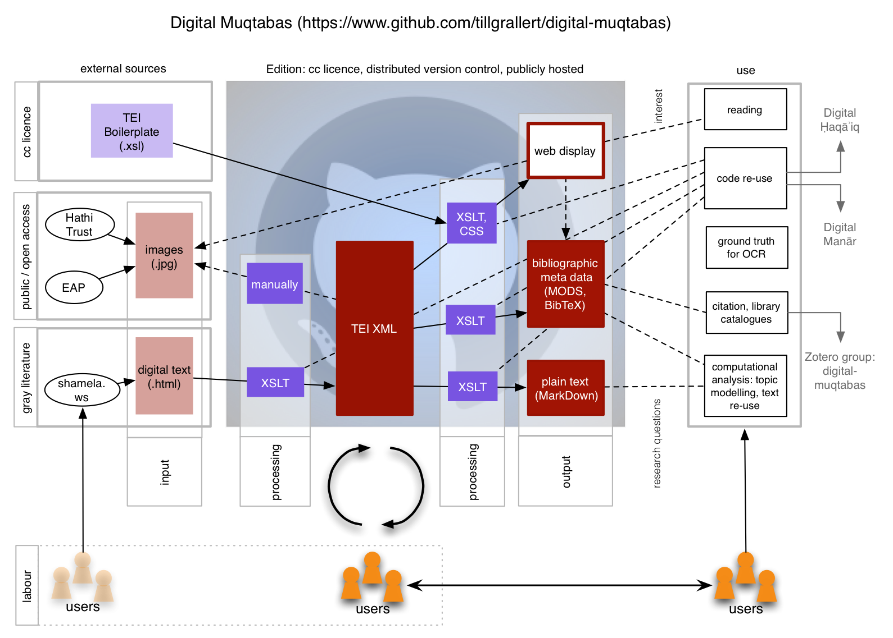
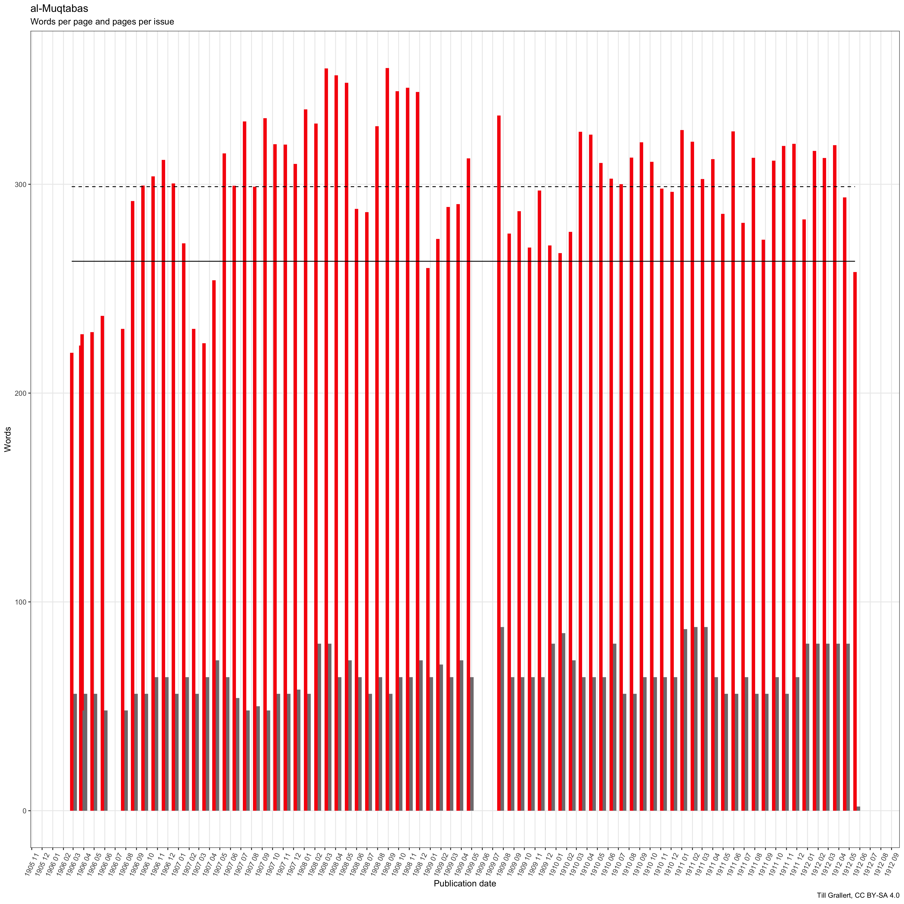
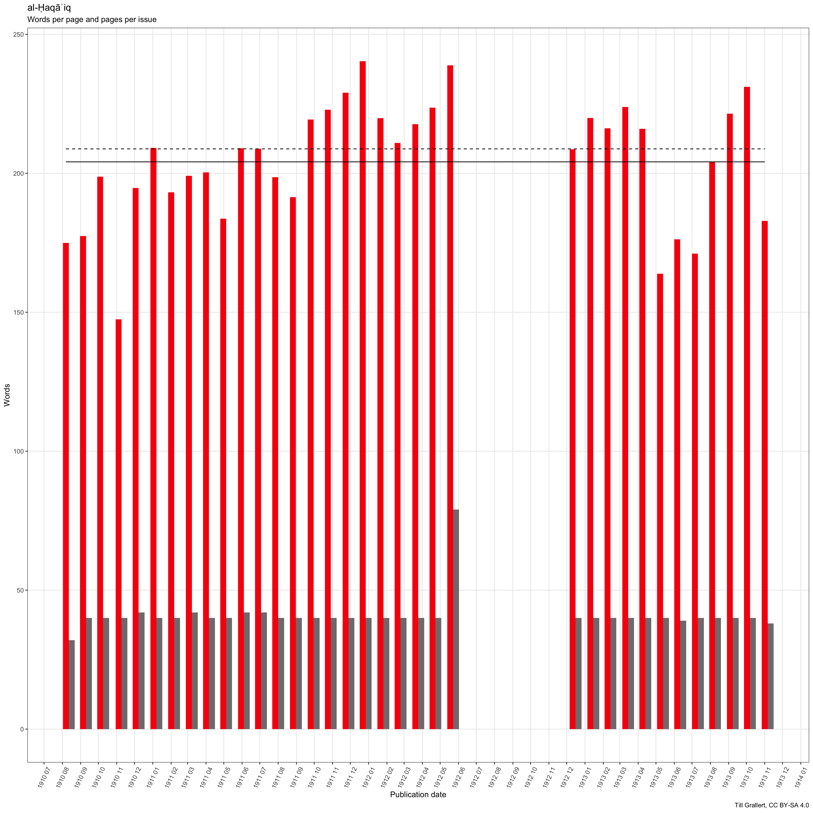
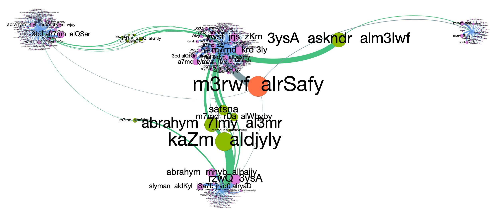
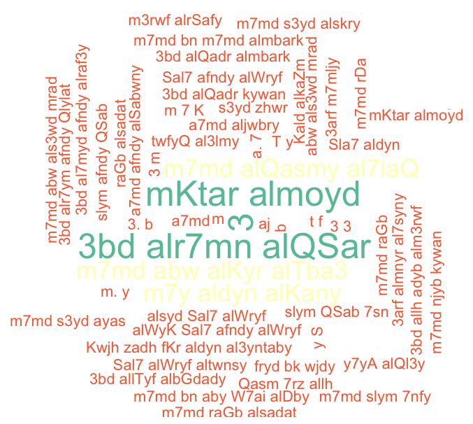
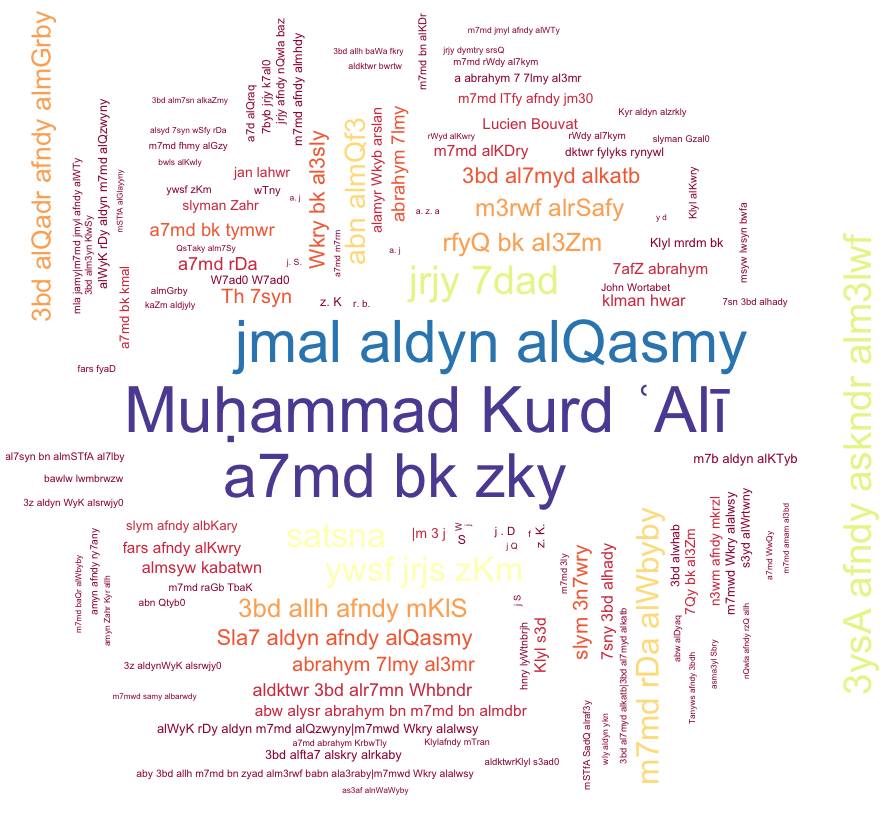
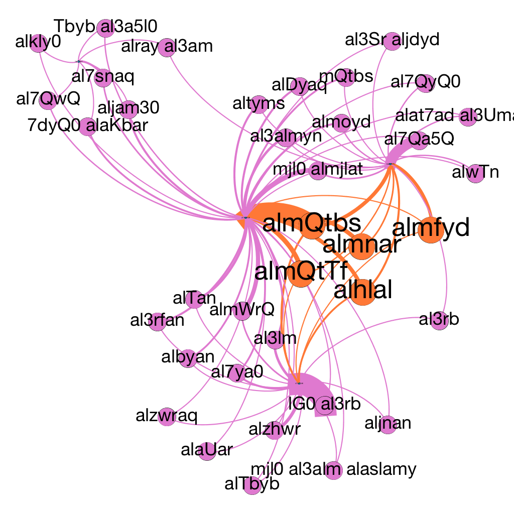
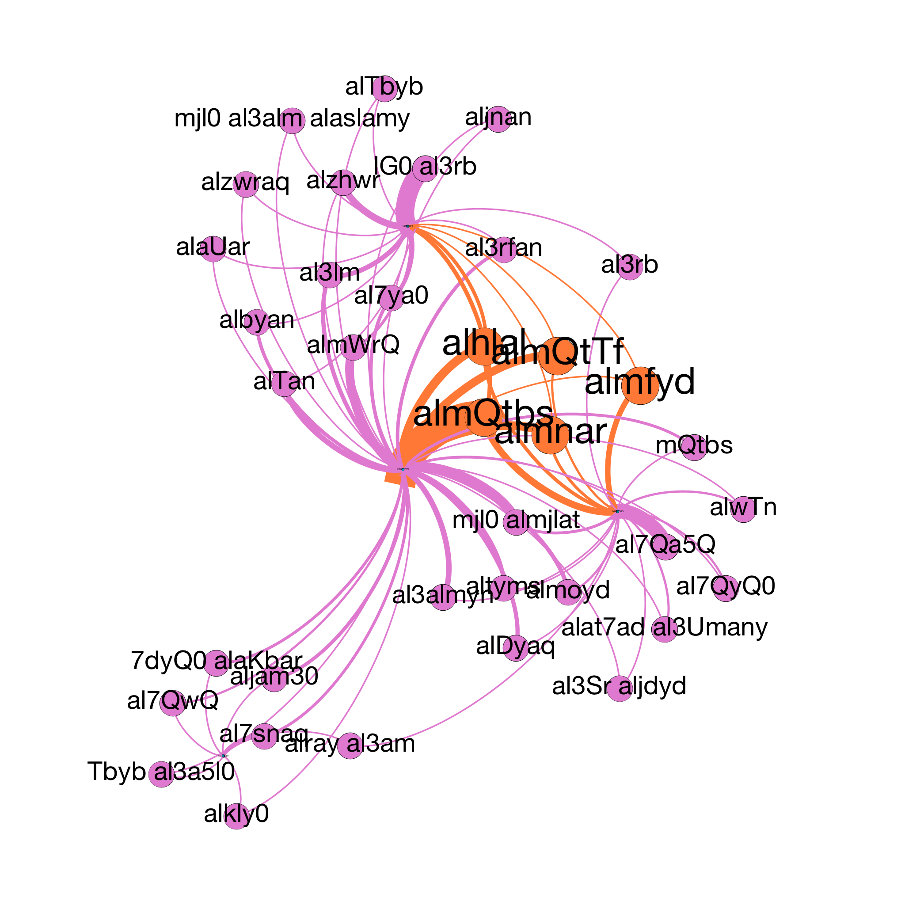

<!-- # processing instructions -->
<!-- ## 1. HTML -->
<!-- pandoc -F pandoc-crossref -s -f markdown-smart -t html5 --toc --include-in-header=/BachUni/programming/Pandoc/css-pandoc_online-publication.txt --include-in-header=/BachUni/programming/Pandoc/css-pandoc_code-highlight_oxygen-xml.txt --email-obfuscation=javascript catch-me-if-you-can.md -o index.html -->
<!-- ## 2. DOCX -->
<!-- pandoc -F pandoc-crossref -s -S -f markdown -t docx catch-me-if-you-can.md -o catch-me-if-you-can.docx -->

<!-- ORCID -->

<!-- licence -->

<!-- release -->

<!-- DOI -->

# About {#sec-about}

>This paper originated in a presentation at Turkologentag 2018 in Bamberg, Germany, 19--21. September 2018.

>The current stable draft of this paper is version [v0.1](https://rawgit.com/tillgrallert/p3a6afa20/v0.1/index.html) and contains unprocessed references to sources and secondary literature, cross-references, and CriticMarkup. To comment / review / annotate this version via hypothes.is click [here](https://via.hypothes.is/https://rawgit.com/tillgrallert/p3a6afa20/v0.1/index.html). The most recent changes are available [here](https://tillgrallert.github.io/p3a6afa20/index.html).

# Introduction

{>>research questions are still missing<<}

This paper presents the dual race to catch up with methodological and epistemological developments outside the realm of Middle East studies and with the global networks of authors and readers enmeshed in late Ottoman periodicals. 

{>>add comment on the need to build one's own corpus for working on texts in non-Western languages<<}

It introduces the project [OpenArabicPE](https://openarabicpe.github.io) as a framework to unite transcriptions of {~~currently two~>a small number of~~} early twentieth-century periodicals{--, *al-Muqtabas* and *al-Ḥaqāʾiq*,--}{>>the corpus needs to be discussed at a later stage<<} from grey online platforms with digital facsimiles for the purpose of validating the former. After substantial modelling efforts, we are now able to generate and analyse bibliographic datasets as well as run first stylometric analyses on this corpus of some {==130 periodical issues of more than 2.2 million words==}{>>update with latest numbers<<}. This corpus is small if compared to the vast data sets available for the global north through [*Chronicling America*](https://chroniclingamerica.loc.gov/), [*Trove*](https://trove.nla.gov.au/) Australia, the [*British Newspaper Archive*](https://www.britishnewspaperarchive.co.uk/) etc. {>>add projects<<}, which gave rise to numerous distant reading projects.[^16] Although our approach can by no means be characterised as distant reading of big data, it is the first systematic attempt to empirically answer core questions for the nascent field of Arabic periodical studies,{--[^17]--} which are in turn indispensable for a proper source critique if one wanted to employ these periodicals for the historiography of the late Ottoman Eastern Mediterranean. For the purpose of the present paper, we will focus our exploration on the question of authorship and references to other periodical titles and the resulting intellectual, social and geographic networks.

[^16]: For studies assessing these corpora and the methodological implications see {Nicholson 2013;Brake 2012;Horrocks 2014;Mussell 2012;Gooding 2016}.For studies and projects based on *Chronicling America* see, for example, {Cordell 2017;Lorang 2015;Torget 2011;Cordell 2015;Smith 2015;Smith 2013;Cordell 2013;Torget 2012;Torget 2012a}. For a study based on *Trove* see {Bode 2016}.

[^17]: There are only very limited systematic studies on Arabic periodicals, everyone of which is concerned with a single periodical only; c.f. {Glaß 2004b;Cioeta 1979a}. At the time of writing, only one study made use of digital texts: {Zemmin 2018}; for methodological comments see also {Zemmin 2016@232-233}.

The periodical press of the late Ottoman Eastern Mediterranean has received scholarly attention since the early twentieth century. Early Arabic periodicals from the late nineteenth and early twentieth centuries, such as Butrus al-Bustānī's *al-Jinān* (Beirut, 1876–86), Yaʿqūb Ṣarrūf, Fāris Nimr, and Shāhīn Makāriyūs' *al-Muqtaṭaf* (Beirut and Cairo, 1876–1952), Muḥammad Kurd ʿAlī's *al-Muqtabas* (Cairo and Damascus, 1906–18/19) or Rashīd Riḍā's *al-Manār* (Cairo, 1898–1941) are at the core of formative discourses that still reverberate through the Arabic-speaking Middle East: the Arabic (cultural) renaissance (*al-nahḍa*), Arab nationalism, and the Islamic reform movement.
However, scholarly approaches to these periodicals have been, for a long time, both encyclopaedic and anecdotal. Often compiled by authors who themselves were journalists, these works adhere to a specific political view of Arab nationalism.[^28] After the publication of some union catalogues and indexes,[^29] focus shifted to the intellectual history of the *naḥda* and Arab nationalism from the 1970s onwards. The focus of this work was---and to a large extent still is---on opinion pieces and editorials in a small sample of canonical journals while the {--social, economic and intellectual --}historiography of the periodical press itself was relegated to the margins. Two noteworthy exceptions to this rule are Donald Cioeta's work on the history of *Thamarāt al-Funūn* and censorship in Ottoman Beirut[^30] and Ami Ayalon's extensive writings on the press in the Arab Middle East.[^31] Detailed studies on longer---if not entire---periods of individual publications are still lacking beyond Cioeta's unpublished thesis and Dagmar Glaß' study on *al-Muqtaṭaf*.[^32]

{>> add one sentence on core questions of authorship, readership, modes of production etc. being open. add comment on the geographic bias of Cairo and Beiurt and nothing beyond<<} 
{>>problem of access and basic information on holdings<<}

[^28]: E.g. {Jundī 1925; Shaykhū 1926; Sarkīs 1929}, {Muruwwa 1961; AlRifāʿī 1969; AlRifāʿī 1969a; Dāghir 1950; Dāghir 1978; Ilyās 1982; Khūrīya 1976}
[^29]: E.g. {ElHadi 1965; AhmedBioud 1969; Hopwood 1970; Murād 1977; Auchterlonie 1977; Aman 1979; DeJong 1979; Duman 1982a; Duman 1986}
[^30]: {Cioeta 1979; Cioeta 1979a}.{-- Due to a fatal accident soon after completing his thesis, he published only one further article: {Cioeta 1982}.--}
[^31]: {Ayalon 1995}; {Ayalon 1984; Ayalon 1985; Ayalon 1987a; Ayalon 1987; Ayalon 1992; Ayalon 2002; Ayalon 2008}.
[^32]: {Glaß 2004b} {>>Add comment on {Dierauff 2018}{Beška 2017}<<}

The better known and at the time widely popular journals---unlike their smaller rivals and more ephemeral newspaper copies---do not face the ultimate danger of their last copy being destroyed in the current onslaught from iconoclasts, institutional neglect, and wars raging through Syria, Libya, Yemen, and Iraq. Yet, copies are scattered across libraries and institutions worldwide. This makes it almost impossible to trace discourses across journals and with the demolition and closure of libraries in the Middle East, they are increasingly accessible to the affluent Western researcher only.

A quick look at *al-Muqtabas*{--, one of the journals in the corpus at the basis of this paper--} shall {--suffice to--} illustrate this point. A search in [WorldCat](https://www.worldcat.org) for the nine volumes of *al-Muqtabas* {--using a combination of Arabic and transcriptions into Latin script--} will return six different bibliographic entries, the first of which has 13 variants (called "editions" in the context of WorldCat), pointing to 34 libraries. If one follows each entry to the holding library's catalogue, one will find that the large majority of collections is incomplete and that collections commonly combine original volumes, reprints, microfilms, microfiches and even photo copies. {>>comment on the geographic distribution of collections<<}

Digitisation promises an "easy" solution to the problems of preservation and access. Instant access to tens if not hundreds of thousands of *digitised* periodical issues from the late Ottoman Empire evokes the gold rush in the American west and many people imagine a promised land of magical one-click solutions to answer any question they might have in an instant.
The public and many scholars expect to be able to put a computer to such diverse tasks as a keyword search: Show me all instances of the word *waṭan* (Arabic for "homeland", "nation") across the ideosphere of the early Arabic press between Morocco and Iraq from its beginnings until the World War I. Or a social network analysis: Show me the discursive field of authors and their texts and its changes over time. These are important and---for a variety of reasons, some of which will be discussed in this article---still open questions. Unfortunately, the eager student of *digitised* Arabic periodicals will immediately find tools, data and skills lacking.

# The promised land of *digitised* Arabic periodicals

<!-- problem: there is no big data. on the difference between *digitised* and *digital* -->

The first question we encounter in our attempt to track the network of authors and texts is to which extent can we submit *digitised* periodicals to computational analysis, or rather, what is the meaning of *digitised* and *access*? The answer is, of course, very different from periodical corpora in Western languages. It is sobering and will put off but the most enthusiastic readers: from large corporate and institution-backed platforms[^1] to grey online libraries[^2] *digitised* commonly  means nothing more than the provision of digital facsimiles in the context of Arabic and Ottoman periodicals. Some platforms, such as [Hathitrust](http://catalog.hathitrust.org/) and [Cengage Gale](http://gale.cengage.co.uk/arabic.aspx), include search functions, but these are extremely limited. The former, Google-powered, platform is obviously dysfunctional for Arabic text if one has a look at the text layer. The latter makes grand claims of "Newly-developed optical character recognition software (OCR) for early Arabic printed script"[^18] but does not make the text layer accessible to scrutiny. We will therefore never know the extent of false negatives (one can manually check for false positives by going through the search results). Beyond copyright, *access* to these *digitised facsimiles* is always restricted to viewing individual pages in web interfaces and limited by subscription fees and membership of specific academic institutions.[^3] To computationally answer the above questions, however, one would need unrestricted access to truly *digital* editions---that is, machine-readable editions of the full text with embedded structural and semantic information and in a standardised exchange format.[^19]

[^1]: Such as [Cengage Gale](http://gale.cengage.co.uk/arabic.aspx), [Hathitrust](http://catalog.hathitrust.org/), the [British Library's "Endangered Archives Programme" (EAP)](http://eap.bl.uk/), [MenaDoc](http://menadoc.bibliothek.uni-halle.de/), ["*Jarāyid*: Arabic newspaper archive of Ottoman and Mandatory Palestine"](http://web.nli.org.il/sites/nlis/en/jrayed), the [Moise A. Khayrallah Center for Lebanese Diaspora Studies](https://lebanesestudies.omeka.chass.ncsu.edu/collections/browse) or the [Institut du Monde Arabe](http://ima.bibalex.org/IMA/presentation/home/list.jsf)
[^2]: such as [*Arshīf al-majallāt al-adabiyya wa-l-thaqāfiyya al-ʿarabiyya*](http://archive.sakhrit.co) or [*al-Maktaba al-Shāmila*](http://www.shamela.ws/), [*Mishkāt*](http://almeshkat.net/), [*Ṣayyid al-Fawāʾid*](http://saaid.net/) or [*al-Waraq*](http://www.alwaraq.net/)
[^3]: It must be noted that the US-based HathiTrust does not provide public or open access to its collections even to material deemed in the public domain under extremely strict US copyright laws when users try to connect to the collection from outside the USA. Citing the absence of editors able to read many of the languages written in non-Latin scripts, HathiTrust tends to be extra cautious with the material of interest to us and restricts access by default to US-IPs. These restrictions can be lifted on a case-by-case basis, which requires at least an English email conversation and prevents access to the collection for many of the communities who produced these cultural artefacts; see [https://www.hathitrust.org/access_use](https://www.hathitrust.org/access_use) for the access policies.
[^18]: {website_eapb}
[^19]: For good overviews on the issue of digital (scholarly) editions see {Driscoll 2016;Pierazzo 2015;Sahle 2013}.

<!-- If the "data" is lacking, can we use (bibliographic) metadata? -->

In the absence of *digital* editions, any meaningful computational analysis of the {--global--} connections between authors, texts, and periodicals as a venue for publication and review requires access to reliable standardised bibliographic metadata as a bare minimum. Unfortunately, even this data is practically non-existent{-- on the article level and the situation is only marginally better on the issue level--}. This is due to ambiguity and incorrect data found in the original artefact; to lacking familiarity with the particularities of these artefacts among cataloguers, librarians and scholars; and to a software stack ill-suited for anything but Western concepts of dates and names and Western scripts. 

{>>Add comment on faulty publication data as provided by the periodicals themselves; a) dates, b) names<<}
Periodicals seem to provide no dating challenges since publication dates were conveniently recorded in a masthead. However, periodicals across the Arabic speaking late Ottoman Eastern Mediterranean made use of at least four calendars. Newspapers and journals provided dates in any combination of the Ottoman fiscal, or *mālī* calendar and the reformed Julian calendar as well as the better known Islamic *hijri* and Gregorian calendars. In addition to at least three different year counts, these calendars and their users also differed in their conception of the calendric day. Most retained the old notion of a day commencing at sundown, while others adopted *alla franca* time with 24 equinoctial hours and a date change at midnight.[^35] Unfortunately supplied dates from mastheads frequently neither matched each other nor the day of the week the paper was supposedly printed on. A particularly illuminating example in our corpus can be found in the masthead to issue 6 of the Damascene journal *al-Ḥaqāʾiq* that read "First of the holy month of *Muḥarram* 1229 [*hijrī*], 3 *Kānūn Awwal* 1327 [*mālī*], and 20 December (*Kānūn Awwal*) of the year 1911 [Gregorian]".[^23] This line contains at least four errors: First the *hijrī* date is set in the wrong century and should read 1329. Second, the days of the *mālī* and Gregorian dates got mixed up. The Gregorian calendar was thirteen days ahead of Julian calendars since the year 1900. The corrected *mālī* date should read 20 *Kānūn Awwal* instead of the third, but because the *mālī* years began in spring with the month of *mārt* (March), the year count should not have been incremented to 1327 with the beginning of the new *hijrī* year. Therefore the correct *mālī* date would have been "20 *Kānūn Awwal* 1326".  The Gregorian date, finally, is even wrong after fixing the mix-up of days with the *mālī* date. Instead of *Kānūn Awwal* (December) it should be *Kānūn Thānī* (January) and since December has 31 days, the correct Gregorian date should ultimately read "2 (instead of the substituted 3 from the original, faulty, *mālī* date) January 1911". How should one record this bibliographic nightmare? And which date-calendar combination should be considered the authoritative one? What if recorded publication dates were fictional to simulate a regular publication cycle and should therefore be conceived of as issue numbers that have only limited relation to an actual date?[^24] 

[^23]: *al-Haqāʾiq* 1(6), available online at <https://openarabicpe.github.io/digital-haqaiq/xml/oclc_644997575-i_6.TEIP5.xml>. Note that digital facsimiles are geo-fenced and only accessible to US IPs.
[^24]: *al-Muqtabas*, for instance, was severely lagging behind its publication schedule by summer 1909. [No. 4(7)](https://tillgrallert.github.io/digital-muqtabas/xml/oclc_4770057679-i_42.TEIP5.xml) was scheduled for Rajab 1327 aH (July/August 1909) according to its masthead but only published in the first week of April the following year; see {muqtabas 76-eap@3}. *al-Ḥaqāʾiq* is more difficult to date through external source because unlike *al-Muqtabas* it was only rarely mentioned in other publications. However, a prolonged dispute with the newspaper *al-Muqtabas* in 1911 provides some clues. {haqaiq i:12@476} referenced {muqtabas 288-eap}. Therefore, it must have been published at least 10 days after the publication date provided by the masthead. {>>*al-Ḥaqāʾiq* 1(6) referenced an article in *al-Muqtabas* 1 December 1910 (#539)<<}

{>>2) lack of knowledge among cataloguers<<}
Any attempt to answer these questions relies on the affordances of available information systems, that is people and their skills, abstract concepts, and actual tools to record and retrieve these data points.
But cataloguers, librarians and even specialists of the late Ottoman Eastern Mediterranean are frequently unfamiliar with calendric systems beyond the solar Gregorian and the Islamic lunar *hijrī* calendars. *Mālī* years are frequently misread as *hijrī* years, which introduces a margin of error of up to two years for the last decades before World War I.[^25]
{>>3) short-comings of the software<<}
Second, most software is unable to work with anything but Gregorian dates out of the box.  Even if cataloguers were able to correctly establish the calendar used in a periodical's masthead, the computing infrastructure would not allow them to enter this date into the digital record.[^20]
Finally, even if bibliographic data is internally kept in structured {--and machine-actionable--} form, it is not commonly shared in a standard-compliant and machine-actionable format, such as MARC or MODS.[^21] A good example for this state of affairs is the British Library's otherwise excellent Endangered Archives Programme (EAP), which digitised periodical holdings of the al-Aqsa Mosque's library in Jerusalem. If we look at the [fourth volume](https://eap.bl.uk/archive-file/EAP119-1-4-3) of the journal *al-Muqtabas* available through EAP, we find that bibliographic information is solely provided in unstructured plain text either through the web interface or the IIIF API.[^22] {~~In addition, p~>P~~}ublication dates are provided as Gregorian months even though the cover clearly states that *al-Muqtabas* follows the "Arabic", i.e. Islamic *hijrī*, calendar and despite each issue reporting the publication date as *hijrī* month. Consequently, there is a dissonance between the facsimile and the bibliographic information. *al-Muqtabas* 4(1) recorded the month of *Muḥarram* 1327 aH in its masthead. Depending on the local observation of the moon in Damascus, the journal's place of publication, this month began around 27 January 1909. Should *al-Muqtabas* 4(1) therefore be considered the January issue? The cataloguers at EAP clearly thought so or their cataloguing software did not allow for date ranges.

[^25]: Stefan Weber and Jens Hanssen, for instance, missed the fact that the birthday of Sultan ʿAbdülḥamīd II (1876--1909) was celebrated according to the Islamic *hijrī* calendar and thus rotated through the solar year. The annual celebrations of the anniversary of the ʿAbdülḥamīd II's accession to the throne were celebrated according to the empire's *mālī* calendar. Yet, leading scholars read these dates as pertaining to the *hijrī* calendar. Due to the mix-up in 1872 and the resulting growing difference between the two calendars, the ʿAbdülḥamīd II's silver jubilee on the throne is wrongly dated to 1901 instead of 1900. {Hanssen 2005@238, 243ff.; Weber 2009@418-420;Deringil 1998@29; Uluengin 2010@20}.

[^35]: The Islamic *hijrī* calendar is a lunar calendar beginning the year with 1 *Muḥarram* and counting years since the prophet Muḥammad's flight (*hijra*) from Mecca to Medina in 622. Dates differ between locations as the beginning of the month is based on sightings of the new moon. They cannot, therefore, be reliably computed. A common workaround without recourse to empirical observations as provided in large tabular publications is to compute the astronomic lunar calendar instead. The reformed Julian calendar is a solar calendar beginning the year with 1 January. Every one hundred years the difference between the Gregorian and Julian calendar increases by one day due to different rules for adding an intercalated 366th day every four years. In the Ottoman context, the reformed Julian calendar is commonly referred to as *rūmī*. Arabic periodicals usually labelled this calendar as *sharqī* (Eastern). The Ottoman fiscal *mālī* calendar is a lunosolar calendar. It is based on the Old Julian calendar beginning the year with 1 March and was designed to synchronise the year count with the *hijrī* calendar. Introduced in 1676 it is also sometimes confusingly called *rūmī*. {--Every 33 lunar years, a *hijrī* year would complete within a single solar *mālī* year. In this case the counting of the *mālī* years skipped a year to catch up with the faster *hijrī* calendar.--} Due to a printing error in the coupon booklets for the Ottoman consolidated debt repayment program for 1872{-- (1288 M instead of 1289 M)--}, synchronisation of *mālī* and *hijrī* years was henceforth abolished. {>>some references needed<<} {Jajko 1993;Rose 1991;Deny 1921;Georgeon 2011}.

[^20]: Consider, for instance, the quasi standard for digital scholarly editions, TEI, which is expressed in XML. According to the XPath specifications, the [`format-date()`](https://www.w3.org/TR/xpath-functions-30/#func-format-date) function supports a number calendars beyond the Gregorian standard, including the Islamic *hijrī* calendar, since version 2.0. However, the actual support for calendars and languages is implementation-dependent and Saxon, the main XSLT, XPath and XQuery processor, has not implemented any of these alternative calendars; see [documentation for `format-dateTime()`](https://www.saxonica.com/html/documentation/functions/fn/format-dateTime.html).

[^21]: The [MAchine-Readable Cataloging (MARC)](http://www.loc.gov/marc/) is a data format maintained by the [Network Development and MARC Standards Office of the Library of Congress (NDMSO)](http://www.loc.gov/marc/ndmso.html). MARC can be serialised as XML but frequently isn't. The [Metadata Object Description Schema (MODS) standard](http://www.loc.gov/standards/mods/), in contrast, is expressed in XML and more human-readable. It is also maintained by the Network Development and MARC Standards Office with input from users.

[^22]: {>>Footnote on IIIF<<}

Even if we had perfectly reliable digital re-mediations of the bibliographic information found in the periodical issues themselves, the vast majority of articles would remain outside our analytical scopes, since publishers did not provide (meaningful) bylines---most articles in {--both--} journals and newspapers from Baghdad, Beirut, Cairo or Damascus did not credit their authors.{>>The illegality of this behaviour is mentioned below<<} One approach would be to subject all articles to stylometric analysis for authorship attribution (more on this below) but this again presupposes truly *digital* editions.

<!-- identify the areas to catch up with -->

Note that a the full text of a periodical is necessary but not sufficient for many analytical queries and distant reading. It is certainly insufficient for close reading. The full text of a periodical would be nothing but a string of words. But periodicals unite different texts of various genres from multiple authors. These texts are commonly grouped into issues and volumes and longer ones were frequently serialised and scattered across issues. Some of these texts will be reprints from other periodicals or first printed publications of much older manuscripts. Some of the texts are responses, etc. In order to make sense of the full text of a periodical for both humans and machines it has to be modelled.

<!-- get the full text -->

Optical character recognition (OCR), the technology to convert an image into a text, has come a long way and even hand-written text recognition (HTR) is fairly successful at least for Latin script.[^9] Automatic recognition of Arabic script, however, is severely lacking behind for a variety of reasons beyond the scope of this paper.[^4] Despite promising developments with the application of machine-learning technologies to pattern recognition,[^7] automatic conversion of images of early Arabic periodicals is hampered by three factors: first, all OCR technologies depend on {--fairly large--} training sets of "gold standard" transcriptions as ground truth; second, low-quality fonts, inks, and paper employed at the turn of the twentieth century will inevitably result in poor print quality; and third, text recognition depends on layout recognition and multi-column texts with various intersections of boilerplate, ads, etc. pose serious challenges. Consequently these texts can currently only be reliably digitised by human transcription.[^12] Funds for transcribing the tens to hundreds of thousands of pages of an average mundane periodical are simply not available, despite of their cultural significance and unlike for valuable manuscripts and high-brow literature.

[^12]: The validity of this statement, of course, depends on the purpose of digitisation. If one was, for instance, interested in distant reading approaches to large corpora, such as the temporal distribution of certain keywords during a long print run, this would allow not just for aggregation on the issue level but probably even periods of full months and more. In consequence, error margins of almost one fourth in both Character Error Rate (CER) and Word Error Rate (WER) become seemingly acceptable; e.g. {Cristianini 2018@144}. Ryan Cordell argues for the importance of theorising the impact of OCR on scholarly findings. Cordell poses that OCR must be considered a new edition subject to "elaborate systems of scholarship, preservation, bureaucracy, human labor, machine processes, and economics"; {Cordell 2017@188}.

[^4]: C.f. {Märgner 2012a}. For recent promising approaches using machine-learning and neural networks see {Romanov_2016}. For examples of the state of Arabic OCR even for well-funded corporations and projects, try searching inside Arabic works on Google Books or HathiTrust. The ["Early Arabic Printed Books" (EAPB) project](http://gale.cengage.co.uk/arabic), currently under development by GALE in collaboration with the British Library, makes repeated claims of employing "newly developed optical character recognition software (OCR) for early Arabic printed script" (see this [factsheet](http://gale.cengage.co.uk/images/EAPB-Factsheet_English_WEB.pdf)). But since they share neither text layers nor error rates or software, their claims cannot be verified. As a substantial number of the digitised books in EAPB are written in languages other than Arabic that employ Arabic script (such as Farsī, Urdu or Ottoman Turkish) and as some works resemble complex manuscripts with multiple commentaries around a main text fully automated text-retrieval is highly unlikely.

[^7]: The [Open Islamicate Text Initiative (OpenITI)](http://iti-corpus.github.io/) project planned to publish its tool chain in 2018. For an overview of their work see <http://islamichistorycommons.org/mem/wp-content/uploads/sites/55/2017/11/UW-25-Savant-et-al.pdf>.

[^9]: One major research project for HTR is [Transkribus](https://transkribus.eu/Transkribus/). Sinai Rusinek and me have begun experimenting with submitting OpenArabicPE's editions as ground truth for training Transkribus. First results for single-column Arabic periodicals are promising and report a CER of less than 10 per cent, which would be sufficient for some distant reading applications.

Grey online-libraries of Arabic literature, namely [*al-Maktaba al-Shamila* (*shamela.ws*)][shamela], [*Mishkat*][almeshkat], [*Saydal-Fawa'id*][saaid] or [*al-Waraq*][alwaraq], provide access to a vast body of (mostly classical) Arabic texts including transcriptions of unknown provenance, editorial principals, and quality for some of the mentioned periodicals. These grey "editions" lack information linking the digital representation to material originals, namely bibliographic metadata and page breaks, which makes them almost impossible to employ for scholarly research.

Since we do not have the resources to proof and correct these texts, we had the idea to build our own corpus by uniting transcriptions from grey online libraries with the digital facsimiles from other sources as a means to verify the quality of the digital text. Thus "Open Arabic Periodical Editions" (OpenArabicPE) was born in autumn 2015.

# OpenArabicPE attempts at catching up

[OpenArabicPE](https://openarabicpe.github.io) establishes a framework for open, collaborative, and fully-referencable scholarly digital editions of early Arabic periodicals. The guiding principles of OpenArabicPE can be summarised as *accessibility*, *sustainability*, *credibility*. Starting with the mostly Damascene periodicals *al-Muqtabas* and *al-Ḥaqāʾiq*, OpenArabicPE demonstrates that one can produce scholarly editions that offer solutions for most of the above-mentioned problems---including the absence of expensive infrastructure---through re-purposing well-established open software platforms and by combining the virtues of immensely popular, but non-academic (and, at least under US copyright laws, occasionally illegal) online libraries of volunteers on the one hand with academic scanning efforts as well as editorial expertise on the other.

{----}

Within OpenArabicPE we devise workflows and tools to transform digital texts from [*shamela.ws*][shamela] into an open, standardised file format (XML) following the [Text Encoding Initiative (TEI)](https://www.tei-c.org)'s guidelines,[^8] to generate bibliographic metadata, and to render a parallel display of text and facsimile in a web browser. We add light structural mark-up for articles, sections, authors, and bibliographic metadata, and link each page to facsimiles from various sources, namely [EAP][bl], [HathiTrust][hathitrust], and [archive.sakhrit.co][sakhrit].[^36] The latter step, in the process of which we also make first corrections to the transcription, though trivial, is the most labour-intensive because page breaks were commonly ignored by *shamela.ws*'s anonymous transcribers. This point needs to be emphasised: each of the c.8500 pages breaks in *al-Muqtabas* and *al-Ḥaqāʾiq* needed to be manually marked by volunteers in order to link facsimiles to the digital text and thus make the text verifiable for human readers.[^6] So far Dimitar Dragnev, Talha Güzel, Dilan Hatun, Hans Magne Jaatun, Xaver Kretzschmar, Daniel Lloyd, Klara Mayer, Tobias Sick, Manzi Tanna-Händel and Layla Youssef have contributed their time to this task.

[^6]: In other instances, such as the journals [*Lughat al-ʿArab*](https://github.com/OpenArabicPE/journal_lughat-al-arab), [*al-Ustādh*](https://github.com/OpenArabicPE/journal_al-ustadh)  or the [Yūsuf Ilyān Sarkīs' *Muʿjam al-maṭbūʿat al-ʿarabiyya wa-l-muʿarraba* (Miṣr: Maṭbaʿat Sarkīs, 1928)](http://shamela.ws/index.php/book/1242), *shamela.ws* did provide page breaks that correspond to a printed edition.
[^8]: TEI XML is the quasi-standard of textual editing and required by funding bodies and repositories for long-term archiving; cf. {DfgPraxisregelnDigitalisierung 2016}.
[^36]: Note that archive.sakhrit.co has since moved to [http://archive.alsharekh.org/](http://archive.alsharekh.org/)

{--](assets/plots/boilerplate_muqtabas.png)--}

All tools and the editions are hosted on the code-sharing platform [GitHub](https://www.github.com) under MIT and Creative Commons [CC BY-SA 4.0](http://creativecommons.org/licenses/by-sa/4.0/) licenses for reading, contribution, and re-use.[^10] {>>mention collaboration with Leipzig and the integration of Muqtabas into CLARIN<<} As part of the editions we provide structured bibliographic metadata for every article  in machine-readable format that can easily be integrated into larger bibliographic information systems{-- or individual scholars' reference managing software--}.[^26]

[^10]: We claim that text of {~~*al-Muqtabas* and *al-Ḥaqāʾiq* itself~>all periodicals in our corpus and originally published before 1920~~} is in the public domain even under the most restrictive definitions (i.e. in the USA); the anonymous original transcribers at *shamela.ws* do not claim copyright; and we only link to publicly accessible facsimile's without copying or downloading them. All code is archived on the Open Science platform [Zenodo](https://www.zenodo.org) that also provides stable identifiers (DOI) for every release.
[^26]: In addition, we make this data accessible through a constantly updated public [Zotero group](https://www.zotero.org/groups/OpenArabicPE).

With OpenArabicPE we argue that by linking facsimiles to the digital text, every reader can validate the quality of the transcription against the original. We thus remove the greatest limitation of crowd-sourced or grey transcriptions and the main source of disciplinary contempt among historians and scholars of the Middle East. Improvements of the transcription and mark-up can be crowd-sourced with clear attribution of authorship and version control using .git and GitHub's core functionality. Such an approach as proposed by Christian Wittern[^27] has recently seen a number of concurrent practical implementations such as project [GITenberg](https://gitenberg.github.io/) led by Seth Woodworth, Jonathan Reeve's [Git-lit](https://github.com/Git-Lit/git-lit), and others.

[^27]: {Wittern 2013}

# Network of authors and texts

With major work on modelling on three journals from Baghdad, Cairo and Damascus---*Lughat al-ʿArab*, *al-Muqtabas* and *al-Ḥaqāʾiq*---done, we can now begin to submit this corpus to initial analyses of the social and geographic networks of authors and their texts as well as the network of periodicals referenced and cited in these three journals.

## OpenArabicPE's corpus

The corpus comprises {--TEI files for--} each issue of *Lughat al-ʿArab*, *al-Muqtabas* and *al-Ḥaqāʾiq* until the end of World War I. {>>total of 165 issues<<} 

{>>*al-Muqtabas*<<}
{--Muḥammad Kurd ʿAlī published 96 issues of his monthly journal *al-Muqtabas* (The Digest / Acquired Learning) between 1906 and 1917/18.--} 
Muḥammad Kurd ʿAlī (1876–1953) was the best known and, after the Young Turk Revolution of 1908, the most influential journalist and intellectual in Damascus. Before establishing his own journal *al-Muqtabas* (The Digest) in Cairo in 1906 and the first daily newspaper to be published in Damascus in 1908 (also confusingly called *al-Muqtabas*), he had held minor government offices and worked at various public and private presses and periodicals in Damascus and Cairo. He was well-acquainted with leading figures of the Islamic reform movement in Egypt and Greater Syria.{--, like Ṭāhir al-Jazāʾirī, Rashīd Riḍā and Muḥammad ʿAbduh.--} He was a member in Ṭāhir al-Jazāʾirī's "senior circle" in the early 1890s in Damascus and later moved and worked in Rashīd Riḍā's and Muḥammad ʿAbduh's circles in Cairo. After the Young Turk Revolution, Kurd ʿAlī returned to his hometown and the publication of *al-Muqtabas* moved from Cairo to Damascus in the journal's third year. In Damascus, *al-Muqtabas* soon became "the boldest, most coherent, consistent and committed proponent of reform and modernity [...] prior to World War I".[^33] Due to conflicts with the authorities over the reprint of a poem, Kurd ʿAlī again fled Damascus for Cairo and Europe in 1912. Consequently, *al-Muqtabas* was published from Cairo for a couple of months before Kurd ʿAlī was allowed to return once again. During World War I and Cemal Pasha's infamous term as commander-in-chief of the 4th Army and governor general of Syria, Kurd ʿAlī was able to win his support. He thus escaped the fate of Shukrī al-ʿAsalī{>> his co-editor at *al-Muqtabas*<<}, ʿAbd al-Ghanī al-ʿUraysī and other journalists from Beirut and Damascus, who were publicly executed on charges of treason. Similarly to their editor, the journal and the newspaper *al-Muqtabas* survived and continued publication until the final days of the war---albeit in shorter and less frequent editions due to material shortages. After the end of the war and the disintegration of the Ottoman Empire, Kurd ʿAlī abandoned the monthly and left the editorship of the revived daily newspaper *al-Muqtabas* to his brother Aḥmad. He founded the Arab Scientific Academy whose president he became in 1919 and served twice as Minister of Education (1920–22, 1928–32) during the French Mandate over Syria.[^34]

The edition of *al-Muqtabas* gathers all 96 issues published between 1906 and 1917/18 with a total of some 7.000 pages and almost 2 million words. {>>comment on print runs<<} Issues consist of longer independent articles and sections with shorter articles such as brief reports on new discoveries and book announcements. Issues and pages differed widely in length. On average, each issue contained 65 pages with almost 300 words or 20354 word per issue.

[^33]: {Seikaly 1981@128}
[^34]: For an autobiographic sketch see {KurdʿAlī 1928@411-425}. For intellectual biographies see {Seikaly 1981; Hermann 1990}.

{>>*al-Ḥaqāʾiq*<<}
Much less is known about the second Damascene journal in our corpus and the people behind it. The *ʿālim* ʿAbd al-Qādir al-Iskandarānī (1875--1943) from the notable al-Kaylānī family, who were closely associated with the Qadriyya Sufi order, published three volumes with a total of 35 issues of *al-Ḥaqāʾiq* (The Facts) in Damascus between 1910 and 1913. {>>Add: periodical of the conservative establishment, already apparent from the layout, content. Main opponent is al-Muqtabas<<} {--Unlike *al-Muqtabas*--} *al-Ḥaqāʾiq* was a periodical of the conservative Muslim establishment, who called themselves *mutayyinūn* (the very pious). This becomes clear from the content of *al-Haqāʾiq* with its focus on Islamic topics, its constant critique of Salafism and "Westernised" journals, such as *al-Muqtabas*, and its makers' apparent lack of familiarity with the by then established layout conventions of Arabic journals.[^37] Unlike Kurd ʿAlī, al-Iskandarānī did not claim a single byline in "his" journal.

Pages contain much less text and issues are much shorter than *al-Muqtabas* with a total of 300186 words across 1436 pages (as some 17 pages are missing from the transcription, the word count is too low). Save for a double issue, the vast majority of issues (28 of 36) comprised 40 pages with an average of slightly more than 200 words each. This results in an average 8577 words per issue compared to the 20354 words of *al-Muqtabas*.

[^37]: For controversies between *al-Muqtabas* and *al-Haqāʾiq* see {Gelvin 2012; Commins 1990@118-122}.

{>>*Lughat al-ʿArab*<<}

<!-- state of the data -->

The quality and significance of the analysis is directly dependent on the quality of the information provided by the periodicals themselves and of our mark-up in the TEI source files. All relevant personal and place names in bylines and other source information must be marked up and linked to local and external authority files{~~. References to authority files~> to~~} allow for the necessary disambiguation and grouping of entities that might be referenced by multiple names in our periodicals, such as "Rashīd Riḍā" and "Owner of al-Manār". In addition, by linking references to external authority files and the semantic web, we can harvest additional information on authors and locations, namely the geolocation for toponyms, transcriptions into Latin script necessary for working with most visualisation tools, and life dates for persons in order to establish the age of authors upon publication.[^44]{>>Comment on the issue of many visualisation tools, such as R and Gephi for macOS, not working with Arabic script<<}

[^44]: {>>footnote on VIAF, GeoNames, Wikidata etc.<<}

## analysis of metadata: network of authors

It is worth going back to the bibliographic metadata, its shortcomings and the resulting consequences for our analysis before looking at this aggregated information. *al-Muqtabas* printed a total of 2737 articles, 2020 of which were shorter articles in sections. Of the 717 independent articles, about two fifths (284) explicitly mentioned an author. Another 39 shorter articles carry bylines. The situation is similar at *al-Ḥaqāʾiq*: Only one fifth (76) of the 360 articles provide explicit author information. {>>add information on the number of words, which is more meaningful than the number of articles<<} 
We can currently identify only a total of 319 named authors in *al-Ḥaqāʾiq*, *al-Ḥasnāʾ*, *Lughat al-ʿArab* and *al-Muqtabas*: 139 for *al-Muqtabas*, 103 for *al-Haqāʾiq*, 52 for *Lughat al-ʿArab*, and 42 for *al-Ḥasnāʾ* [See word clouds below].[^5] Quite a significant number appear only with their initials, particularly in *al-Ḥaqāʾiq*, and---with the exception of *al-Ḥasnāʾ*---all of them were men. 

### the network

Knowing the importance of certain authors for an individual periodical is the basis for mapping the {>>social<<} network of authors across the late Ottoman ideosphere.{>>these findings would need to be contextualised by traditional intellectual history<<} The aim would be to map such a network for the hundreds of journals and newspapers published between Alexandria and Aleppo, Jaffa and Basra. Nevertheless, this method already provides valuable insights using our small corpus of bibliographic metadata. The first observation, common to all social networks, is that only a very small number of nodes (14 of 319) are of relative importance, as measured in degree (number of edges connecting to a node) and weight of the edges{-- connecting them to the journals--}. In the below network plot, edges are drawn between authors and journals. {>>comment that we are "abusing" network analysis software for plotting a bi-modal network of authors and journals without projection<<} The thickness of the edges and size of nodes are functions of the number of articles carrying the byline of a given author. Colours signify the out-degree or the number of journals an author is connected to. Authors who published only in a single journal form dense clusters around that periodical's node. These are: *al-Ḥaqāʾiq* to the left, *al-Muqtabas* top centre, *Lughat al-ʿArab* bottom centre, and *al-Ḥasnāʾ* to the right.

{>>add statistics<<}

If we look at the central nodes of the network more closely, we can observe that only one author published in all four journals: the famous poet Maʿrūf al-Ruṣāfī from Baghdad, who mostly authored *qaṣāʾid* on current political affairs. He moved to Istanbul after the Young Turk Revolution, where he worked as an Arabic teacher at the Royal College and at the newspaper *Sabīl al-Rashad*. He was elected MP for al-Muthanna (Iraq) in 1912 and 1914. After WWI he became a member of the Arab Scientific Academy, established by Muḥammad Kurd ʿAlī in Damascus.[^45] al-Ruṣāfī's close ties to *al-Muqtabas* and Kurd ʿAlī are further evident in the announcement in 1910 for the publication of a first collection of his poems, in which *al-Muqtabas* claimed that he is known among some people as "the poet of *al-Muqtabas*" and---wrongly---that "more than three quarters [of the *qaṣāʾid* therein] had been published in this journal".[^46]

All other 13 central nodes had bylines in only two out of four journals. Only eight of the fourteen authors can be found in international authority files as aggregated in [VIAF (virtual international authority file)](http://viaf.org), which at least means that they have not authored works catalogued in any of the contributing libraries (which, unsurprisingly, have a bias towards the Global North).[^48] Those for whom we have biographic information (employing more traditional close reading of Arabic prospographic literature)[^49] were on average in there mid-thirties during the years under investigation.
There is a {==surprising==}{>>why?<<} number of Iraqis and a notable absence of Syrians from this network of two Damascene journals and one periodical from Beirut and Baghdad each. Among the eleven identifiable authors, there are six Iraqis{-- from Baghdad and Najaf--}: al-Ruṣāfī, al-Dujaylī, al-ʿAmr, al-Karmalī (often writing under the pen name Sātisnā), the two al-Shabībī brothers; three Egyptians: al-Rāfiʿī, Muḥarram and Yakan; and only two Syrians al-Maʿlūf and Ṭabbākh. {==Less surprising is the religious composition: only two of the core nodes were Christians.==}{>>do I need this? Well there is an argument as to the dominance of Christian Arabs in the *nahḍa*<<}
In terms of education and occupations the core nodes are examplary for the bourgeois middle-class intelligentsia of their time: many attended Ottoman state schools in addition to more traditional, religious venues of education; many knew foreign languages in addition to Arabic and Ottoman; some were trained or even taught  abroad in the colonial centres of Paris and London; some served in the Ottoman bureaucracy; some were educators. There is also a significant number of poets (7) among the central nodes[^50] and a small number of politicians (MPs).
The more prolific of them were themselves journalists who at one time or another operated their own periodical(s): al-Ruṣāfī, {--ʿIsā Iskandar--} al-Maʿlūf, al-ʿAmr, Muḥammad Bāqir al-Shabībī, {--Kāẓim--} al-Dujaylī and {--Buṭrus bin Jibrāʾīl Yūsuf ʿAwwād, commonly known as Father Anastās Mārī--} al-Karmalī{-- and writing under  the pen name Sātisnā--}, the publishers of *Lughat al-ʿArab*. Looking at the latter, the importance of *al-Muqtabas* in this small network (and beyond) cannot be overstated: al-Karmalī signed more articles in *al-Muqtabas* than his own journal *Lughat al-ʿArab*. The connection to Damascus and Muḥammad Kurd ʿAlī is further evident in four of the central nodes becoming members of the Arab Scientific Academy in Damascus after World War I, whose first president was Kurd ʿAlī himself.[^51]

Another striking observation is that despite two of the journals in our corpus, *al-Muqtabas* and *al-Ḥaqāʾiq*, were published in the same city, there is only very limited overlap. This contradicts the common assumption that due to the very small size of local journalistic circles---in 1912, five monthly journals were published in Damascus and none had a print run of more than a few hundred copies[^47]---there would be a substantial overlap in authorship.

[^45]: {==Ziriklī 7:268-269==}{>>find correct bibliographic info for this edition<<}
[^46]: *al-Muqtabas* 4(10), p.620
[^47]: {Thomsen 1912@214}
[^48]: contributing institutions and libraries are listed on the homepage [http://viaf.org](http://viaf.org).
[^49]: {>>footnote on the most common prosopographic dictionaries for the period under study<<}
[^50]: al-Ruṣāfī, al-Dujaylī, the two al-Shabībī brothers, al-Rāfiʿī, Muḥarram, Yakan
[^51]: al-Ruṣāfī, al-Dujaylī, al-Maʿlūf, Muḥammad Riḍā al-Shabībī.

| rank   | author.id.oape   | author.id.viaf                                 | author.name             | author.birth   | author.death   | word.count   | character.count   | article.count   | journal.count   | author.name.transliterated   |
| ------ | ---------------- | ---------------------------------------------- | ----------------------- | -------------- | -------------- | ------------ | ----------------- | --------------- | --------------- | ---------------------------- |
| 1      | 411              | [14924300](https://viaf.org/viaf/14924300)     | معروف  الرصافي          | 1875-01-01     | 1945-01-01     | 15038        | 64012             | 31              | 4               | m3rwf  alrSafy               |
| 2      | 396              | NA                                             | كاظم   الدجيلي          | 1884           | 1970           | 38050        | 165405            | 28              | 2               | kaZm   aldjyly               |
| 3      | 647              | NA                                             | إبراهيم  حلمي  العمر    | 1890           | 1942           | 40747        | 186244            | 22              | 2               | abrahym  7lmy  al3mr         |
| 4      | 533              | [40250618](https://viaf.org/viaf/40250618)     | عيسى  اسكندر  المعلوف   | 1869-04-11     | 1956-07-02     | 23383        | 105770            | 22              | 2               | 3ysA  askndr  alm3lwf        |
| 5      | 227              | [39370998](https://viaf.org/viaf/39370998)     | ساتسنا                  | 1866-08-05     | 1947-01-07     | 20106        | 88510             | 15              | 2               | satsna                       |
| 6      | 429              | [22006374](https://viaf.org/viaf/22006374)     | محمد  رضا  الشبيبي      | 1889-01-01     | 1965-01-01     | 24156        | 107093            | 12              | 2               | m7md  rDa  alWbyby           |
| 7      | 566              | NA                                             | محمد  الهاشمي           | NA             | NA             | 2717         | 11490             | 6               | 2               | m7md  alhaWmy                |
| 8      | 410              | [236524859](https://viaf.org/viaf/236524859)   | مصطفى  صادق  الرافعي    | 1880-01-01     | 1937-05-14     | 3711         | 15854             | 6               | 2               | mSTfA  SadQ  alraf3y         |
| 9      | 428              | NA                                             | محمد  باقر  الشبيبي     | 1889           | 1960           | 3331         | 15007             | 5               | 2               | m7md  baQr  alWbyby          |
| 10     | 1                | NA                                             | أبو الضيا               | NA             | NA             | 5836         | 26695             | 4               | 2               | abw alDya                    |
| 11     | 910              | [60500457](https://viaf.org/viaf/60500457)     | أحمد  محرم              | 1877           | 1945           | 1543         | 6917              | 4               | 2               | a7md  m7rm                   |
| 12     | 3                | NA                                             | ا. ج                    | NA             | NA             | 639          | 2976              | 3               | 2               | a. j                         |
| 13     | 786              | [63117968](https://viaf.org/viaf/63117968)     | محمد  راغب  طباخ        | 1877           | 1951           | 2633         | 11718             | 3               | 2               | m7md  raGb  TbaK             |
| 14     | 2834             | [36771043](https://viaf.org/viaf/36771043)     | ولي الدين   يكن         | 1873           | 1921-03-06     | 795          | 3334              | 2               | 2               | wly aldyn   ykn              |

Table: authors that published in more than one journal in our corpus comprising *al-Ḥaqāʾiq*, *al-Ḥasnāʾ*, *Lughat al-ʿArab* and *al-Muqtabas*

### individual periodicals
#### *al-Muqtabas*

Only 50 authors published more than one article in *al-Muqtabas*. Two of the four most prolific authors with more than ten bylines to their names wrote from Baghdad (See table below): Maʿrūf al-Ruṣāfī (24 articles) and Buṭrus bin Jibrāʾīl Yūsuf ʿAwwād, using the pen name Sātisnā (14). ʿĪsā Iskandar al-Maʿlūf (20) wrote mostly from Zaḥle and Yūsuf Jirjis Zakham (13) from Omaha and Lincoln, Nebraska, USA. Only the fifth most prolific author was a native resident of Damascus: {~~Jamāl al-Dīn al-Qāsimī (8)~>Muḥammad Kurd ʿAlī himself (12)~~}. {>>add comments on genre of texts by these authors<<}

<!-- The majority of the remaining authors contributed from the cities of Greater Syria and Egypt, but some wrote from cities in France. -->

[^5]: These word clouds were produced with R on macOS. Take note that most visualisations in R for macOS---unlike Windows or Linux---cannot correctly display Arabic script.

<!-- Muqtabas: authors by byline -->

| rank |                author.id.viaf                |     author.name     | author.birth | author.death | article.count |
|------|----------------------------------------------|---------------------|--------------|--------------|---------------|
|    1 | NA                                           | NA                  | NA           | NA           |          2630 |
|    2 | [14924300](https://viaf.org/viaf/14924300)   | معروف الرصافي       | 1875         | 1945         |            27 |
|    3 | [40250618](https://viaf.org/viaf/40250618)   | عيسى اسكندر المعلوف | 1869         | 1956         |            20 |
|    4 | [39370998](https://viaf.org/viaf/39370998)   | ساتسنا              | 1866         | 1947         |            14 |
|    5 | NA                                           | يوسف جرجس زخم       | 1880         | NA           |            13 |
|    6 | [32272677](https://viaf.org/viaf/32272677)   | محمد كرد علي        | 1876         | 1953         |            12 |
|    7 | [19737865](https://viaf.org/viaf/19737865)   | أحمد تيمور          | 1871         | 1930         |             9 |
|    8 | NA                                           | إبراهيم حلمي العمر  | 1890         | 1942         |             9 |
|    9 | [93607460](https://viaf.org/viaf/93607460)   | جمال الدين القاسمي  | 1866         | 1914         |             8 |
|   10 | [49218655](https://viaf.org/viaf/49218655)   | أحمد زكي            | 1866         | 1934         |             7 |
|   11 | [32410755](https://viaf.org/viaf/32410755)   | حافظ إبراهيم        | 1871         | 1932         |             7 |
|   12 | [28125663](https://viaf.org/viaf/28125663)   | رفيق العظم          | 1865         | 1925         |             7 |
|   13 | [118432135](https://viaf.org/viaf/118432135) | عبد القادر المغربي  | 1867         | 1956         |             7 |
|   14 | [22006374](https://viaf.org/viaf/22006374)   | محمد رضا الشبيبي    | 1889         | 1965         |             7 |
|   15 | [305214884](https://viaf.org/viaf/305214884) | جرجي حداد           | NA           | 1916         |             5 |

Table: The fifteen most prolific authors in *al-Muqtabas* by number of bylines.

The four men out of the five, for which we can find biographical records, are in many aspects exemplary of the modernising late Ottoman Empire and the Middle East: Coming from a plurality of religious and social backgrounds---Greek Orthodox, Catholic and Sunnī Muslim, priest and leading Salafi thinker of the second generation, part-time officials, of simple means and members of the old elites---they belonged to the same generation (born between the mid-1860s and mid-1870s) and worked as journalists, teachers, and occasionally politicians. All of them were highly mobile and well-travelled and had good command of local as well as foreign languages---to the extent that some of them published translations. The fifth man is not less exemplary, even though his story seems to be rather uncommon among journalists: Yūsuf Jirjis Zakham was one of the many emigrants from Greater Syria to America. He arrived in the USA in 1902 and was naturalised in 1904, settled in Lincoln, Nebraska, where he married Myra from Iowa and had at least five children. Both spouses were literate and Joseph George Zakem provided his profession as newspaper correspondent in the 1910 US Federal Census.[^43]

[^43]: {UnitedStatesCensus 1910}{UnitedStatesCensus 1920;UnitedStatesCensus 1930;UnitedStatesCensus 1940}   

{>>Further comments on this table:
    1. all but two of the most frequently published authors have entries in authority files and wikipedia
    2. data from the authority files shows that all but one were born between the mid-1860s and the mid-1870s
<<}

#### *al-Ḥaqāʾiq*

The picture is different for *al-Ḥaqāʾiq*, which was repeatedly in conflict with *al-Muqtabas* over the latter's supposed moral laxity. Its most prolific contributors were Damascene Sunni religious scholars from notable families, many of whom were at least one generation older than its opponents, among them Ibrāhīm Mardam Bek, Muḥammad ʿĀrif al-Munīr al-Ḥusaynī (b.1847/48), Mukhtār al-Muʾayyad (b.1822) and Muḥammad al-Qāsimī (b.1843), whose son Jamāl al-Dīn al-Qāsimī was among *al-Muqtabas*' contributors. Against this backdrop the initially surprising finding of practically no overlap between the two networks of authors published in journals from the same city, becomes less so.

| rank   | author.id.viaf                                    | author.name                                  | author.birth   | author.death   | article.count   |
| ------ | ------------------------------------------------- | -------------------------------------------- | -------------- | -------------- | --------------- |
| 1      | NA                                                | NA                                           | NA             | NA             | 286             |
| 2      | NA                                                | عبد الرحمن القصار                            | 1863           | c.1931         | 8               |
| 3      | NA                                                | إبراهيم خليل مردم بك                         | NA             | NA             | 7               |
| 4      | [299025643](https://viaf.org/viaf/299025643)      | محمد عارف المنير                             | 1847/48        | 1923/24        | 5               |
| 5      | [53094077](https://viaf.org/viaf/53094077)        | محمد فريد وجدي                               | 1875           | 1954           | 5               |
| 6      | [58892856](https://viaf.org/viaf/58892856)        | صالح الشريف                                  | 1869           | 1920           | 4               |
| 7      | NA                                                | ع                                            | NA             | NA             | 4               |
| 8      | [51567828](https://viaf.org/viaf/51567828)        | محمد  القاسمي الحلاق                         | 1843           | 1900           | 4               |
| 9      | NA                                                | محمد سليم الحنفي                             | NA             | NA             | 4               |
| 10     | [267054449](https://viaf.org/viaf/267054449)      | مختار المؤيد                                 | 1822           | 1921           | 4               |
| 11     | NA                                                | أبو الضيا                                    | NA             | NA             | 3               |
| 12     | NA                                                | أحمد الجوبري                                 | NA             | NA             | 3               |
| 13     | NA                                                | احمد الباشا                                  | NA             | NA             | 3               |
| 14     | NA                                                | صلاح الدين الزعيم                            | NA             | NA             | 3               |
| 15     | [60500457](https://viaf.org/viaf/60500457)        | أحمد محرم                                    | 1877           | 1945           | 2               |

Table: The fifteen most prolific authors in *al-Ḥaqāʾiq* by number of bylines

#### *Lughat al-ʿArab*

## going beyond bibliographic metadata

We can easily add another dimension to our analysis of the authors published in *al-Muqtabas* and *al-Ḥaqāʾiq*. One could argue that, within genre boundaries, the number of texts is less significant for the relative importance of an author than the total length of all texts by a single author. With access to the full text with structural mark-up, we can easily calculate word counts. Muḥammad Kurd ʿAlī himself would immediately become the most important author (see table below) due to his lengthy reports from a journey across Europe, which he later published as a collection titled *Gharāʾib al-gharb*. He would be followed by Aḥmad Zakī (Pasha), an important Egyptian philologist and politician, and by Jamāl al-Dīn al-Qāsimī. Also included in this list of the ten most prolific authors published in *al-Muqtabas*, is Ibn al-Muqaffaʿ (d.759), the famous author of *Kalīla wa dhimna*, which points to an important function of *al-Muqtabas*: the publication of hitherto unpublished manuscripts and the re-print of classics. This is also attested to by the presence of Aḥmad (Bey) Taymūr in the above list of most important authors by number of articles. An avid collector of manuscripts, Aḥmad Taymūr provided many such manuscript to Muḥammad Kurd ʿAlī for publication and he frequently wrote the introductions.

<!-- Muqtabas: authors by word count -->

| rank |            name           | words | articles |
|------|---------------------------|-------|----------|
| 1    | Muḥammad Kurd ʿAlī        | 42489 |        7 |
| 2    | Aḥmad Zakī                | 40311 |        7 |
| 3    | Jamāl al-Dīn al-Qāsimī    | 38541 |        8 |
| 4    | Jirjī Ḥaddād              | 24124 |        5 |
| 5    | ʿĪsā Iskandar al-Maʿlūf   | 23297 |       20 |
| 6    | Yūsuf Jirjis Zakham       | 21613 |       13 |
| 7    | Sātsunā                   | 19849 |       14 |
| 8    | Muḥammad Riḍā al-Shabībī  | 17894 |        7 |
| 9    | Ibn al-Muqaffaʿ [sic!]    | 15520 |        4 |
| 10   | ʿAbd al-Qādir al-Maghribī | 14074 |        7 |
| ...  |                           |       |          |
| 14   | Maʿrūf al-Ruṣāfī          | 12437 |       24 |

Table: authors in *al-Muqtabas* sorted by number of words.

*al-Muqtabas* and *al-Ḥaqāʾiq*, like any other periodical at the time, seriously violated the Ottoman press code that required identifiable author information being published alongside each article.{>>add footnote with comment and reference to sources<<} This also means that any analysis of bibliographic information is based on only a small sample of either periodical.

# Stylometry

What are the consequences of such a severe lack of information and are there means of filling the gap? One obvious approach to follow would be to submit the entire corpus to stylometric analysis. Stylometry is one of the methods frequently referred to as *distant reading*.[^13]  It can be summarised as the statistical analysis of literary style for the purpose of authorship attribution and genre detection, whereby "style" commonly means a frequency count of vocabulary used in a given text.[^11] Stylometry is based on the empirical observation "that authors tend to write in relatively consistent, recognizable and unique ways"[^14] which is particularly true for an author's vocabulary. Stylometry then computes degrees of similarity between texts, called distance measure, through {--various methods of --}comparing multivariant frequency lists of textual features. {--This is not the space to discuss the intricacies of stylometry for authorship attribution, the available tools and the necessary amount of pre-processing to be applied to Arabic texts before submitting them to stylometric analysis.--} The important catch here is that in order to establish similarities, one has to have access to a significant corpus of digital texts by authors likely to be found among the unattributed texts. If we only compare every article in our periodical corpus to every other article in the same corpus, we cannot possibly identify any author not yet named in a byline. Instead, the best we could hope for would be to establish groups of texts that have a certain likelihood of having been authored by the same person.

[^14]: {Laramée 2018}

[^13]: For a good summary of genealogy of large-scale literary history under the label "distant reading" see {Underwood 2017}. The most often referenced founding works are {Moretti 2013} (collection of reprinted essays), {Jockers 2013}.

[^11]: For an introduction to stylometry see {>>add references<<}

There is some debate in stylometry as to which style-markers and distance measure should be considered for authorship attribution, but throughout this following sections of this paper I have settled on lists of Most Frequent Words (MFWs) and Burrow's Delta, which can be visualised as dendrograms.[^38] Unlike other forms of computational linguistics, texts should not be pre-processed by, for instance, morphologising or lemmatizing. All stylometric analysis {--in this paper--} was done using the "stylo" package for R[^15] on plain-text exports from the TEI files.[^41] Results were then visualised using [Gephi](https://gephi.org).[^42]

Maciej Eder, inspired by phylogenetics, suggested to use *bootstrap consensus trees* and *consensus networks* in order to separate signal and noise and in order to overcome selection bias when picking from a range of dendrograms. In the latter method, one computes the nearest neighbour as well as the first two runners-up for a sequence of MFWs, let's say from 100 to 1000 MFWs in increments of 100, and then combine the results in a single output, which serves as a form of self-validation for the more robust signals. The results can then be visualised using {==social network analysis.==}{>>correct term?<<}[^39] 
<!-- minimum length of texts -->
There has been some debate about the minimal required length for attribution. In order to experimentally establish a threshold length, Eder ran a series of stylometric analyses on medium-sized corpora of prose texts in English, Polish, German, Hungarian, Latin and Greek using Burrow's Delta on 200 MFWs. He found that 5000 words is the minimal length for meaningful attribution below which the signal is "immensely affected by random noise".[^40] Yet, contrary to common assumptions that longer text will lead to ever improving attribution results, Eder also established that beyond a length of 15000 words accuracy of authorship attribution does not improve any further. 
These findings have severe implications for the application of stylometry to periodicals---most texts are much shorter than 5000 words and even the longer ones are too short for random sampling. Nevertheless, {--upon close scrutiny of the results--} our first experiments with stylometric analysis yielded promising results and show at least three distinct signals: genre, author and translator/editor.

{>>*al-Muqtabas*, *al-Ḥaqāʾiq*, *Lughat al-ʿArab*: 50 articles above 5000 words, 297 between 2000 and 5000, 449 between 1000 and 2000<<}

[^15]: {Eder 2016b}
[^38]: {>>footnote on Burrow's Delta<<}
[^39]: {Eder 2017}
[^40]: {Eder 2015@170}
[^41]: {>>footnote on my pre-processing pipeline<<}
[^42]: footnote on Gephi

## first results 

Our initial submission of a corpus of all articles longer than 3000 words to stylometric analysis using bootstrap consensus trees for 100--1000 MFWs confirmed the methods usefulness by establishing clusters of: a) texts from the same authors or translators; b) serialised texts with or without explicit authorship information; c) texts within the same genre, such as travellogues or *qaṣāʾid*; d) manuscripts by different authors but with the same editor.

# Geographic distribution

Successful stylometric authorship attribution, will not fill the gap in geographic information in all but the most obvious and likely case, namely that a large part of the unattributed articles were indeed written by a periodical's editor. In the case of *al-Muqtabas*, we know the whereabouts of Muḥammad Kurd ʿAlī during most of the time he published the journal and could thus easily assign locations to articles. However, given that we are interested in the *network* of authors, texts, and locations, this would be an utterly pointless endeavour.

If we assume that information on the place of writing of any one article was not generally considered sensitive information to be protected in all but the most harmless cases and that most articles where authored by the publishers and at the place of publication, one can nevertheless arrive at a meaningful picture of the geographic distribution of authors and the origin of articles:

{>>missing comment on maps<<}

# Network of referenced periodicals

{>>missing conclusion<<}

[almeshkat]: http://almeshkat.net/
[alwaraq]: http://www.alwaraq.net/
[bibalex]: http://ima.bibalex.org/IMA/presentation/home/list.jsf
[menadoc]: http://menadoc.bibliothek.uni-halle.de/
[bl]: http://eap.bl.uk/
[hathitrust]: http://catalog.hathitrust.org/
[openarabicpe_schema]: https://github.com/OpenArabicPE/OpenArabicPE_ODD
[rawgit]: https://tillgrallert.github.io/digital-muqtabas/xml/oclc_4770057679-i_54.TEIP5.xml#pb_61.d1e2036
[rawgit 2]: https://tillgrallert.github.io/digital-muqtabas/xml/oclc_4770057679-i_59.TEIP5.xml#pb_51.d1e2281
[rawgit 3]: https://tillgrallert.github.io/digital-muqtabas/xml/oclc_4770057679-i_38.TEIP5.xml#p_60.d1e2238
[rawgit 4]: https://tillgrallert.github.io/digital-muqtabas/xml/oclc_4770057679-i_39.TEIP5.xml#gap_1.d1e3111
[rawgit 5]: https://tillgrallert.github.io/digital-muqtabas/xml/oclc_4770057679-i_71.TEIP5.xml#pb_126.d1e4373
[saaid]: http://saaid.net/
[sakhrit]: http://archive.sakhrit.co
[shamela]: http://www.shamela.ws/
[shamela 2]: http://shamela.ws/index.php/book/26523
[wikisource]: https://ar.wikisource.org/wiki/%D9%85%D8%AC%D9%84%D8%A9_%D8%A7%D9%84%D9%85%D9%82%D8%AA%D8%A8%D8%B3/%D8%A7%D9%84%D8%B9%D8%AF%D8%AF_1

